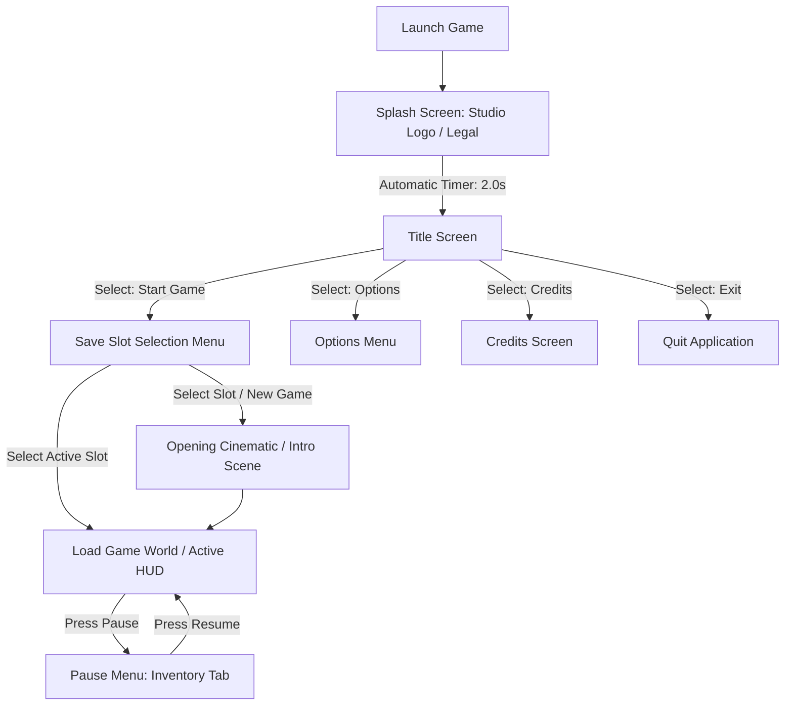
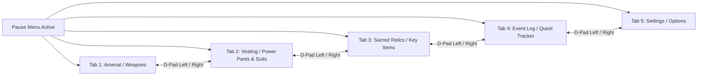

# Menus, UX Navigation Flow & Scene Hierarchy
## Project: The Legacy of Tomba & the Evil Pigs' Curse

---

## 1. Global Screen Transition Architecture

The flow of user interaction from boot-up to active gameplay is designed to minimize friction, ensuring the player can access active gameplay sessions in fewer than three physical controller presses.



---

## 2. Screen-by-Screen Functional Specifications

### 2.1 The Splash Screen
* **Behavior**: Displays the game studio and publisher logos.
* **Transition**: The logos fade in over $0.5 \, \text{seconds}$, remain fully opaque for $1.0 \, \text{second}$, and fade out over $0.5 \, \text{seconds}$.
* **Bypass**: Pressing the *Start/Confirm* button skips the sequence and moves directly to the Title Screen.

### 2.2 The Title Screen
* **Aesthetic**: Dynamic background displaying the *Game Key Art*. Simple, high-contrast text overlay on the left third of the screen.
* **Options List**:
  1. **Start Game**: Opens the Save Slot Selection Menu.
  2. **Options**: Opens the Settings panel (Video, Audio, Accessibility).
  3. **Credits**: Rolls credits on a slow vertical scroll.
  4. **Exit Game**: Safely shuts down the game application (hidden on console platforms).

### 2.3 Save Slot Selection Menu
The menu displays three active manual slots plus one read-only auto-save backup slot.

```
  +-------------------------------------------------------------+
  |                      SELECT SAVE SLOT                       |
  +-------------------------------------------------------------+
  |  [SLOT 1]  |  [SLOT 2]                |  [SLOT 3]           |
  |  Tomba     |  - Empty Slot -          |  Tomba              |
  |  Era 1     |                          |  Era 2              |
  |  45,000 AP |                          |  190,000 AP         |
  |  Progress: |                          |  Progress:          |
  |  [||||   ] |                          |  [||||||||]         |
  |  Playtime: |                          |  Playtime:          |
  |  04h 32m   |                          |  14h 05m            |
  +-------------------------------------------------------------+
  |  [AUTO-SAVE] Last transition: 2 mins ago                    |
  +-------------------------------------------------------------+
```

---

## 3. In-Game Pause Menu & Inventory Navigation

Pressing the `Pause` key transitions the active gameplay screen into a desaturated state, bringing up a clean, tabbed overlay interface.



### 3.1 UX Design Rules for Menu Interaction
* **No Input Lag**: Hovering over different tabs must instantly update the active item panel in under $16 \, \text{milliseconds}$ ($1 \, \text{frame}$ at $60 \, \text{fps}$).
* **Active Selection Feedback**: Selected options and icons are surrounded by a rotating yellow rope-particle border and expand slightly by $10\%$ scale to signify cursor focus.
* **Audio Cue Integration**: Every hover interaction plays a low-frequency click (`SFX_UI_HOVER`), and confirming an item equip action triggers a distinct high-frequency snap sound (`SFX_UI_EQUIP`).