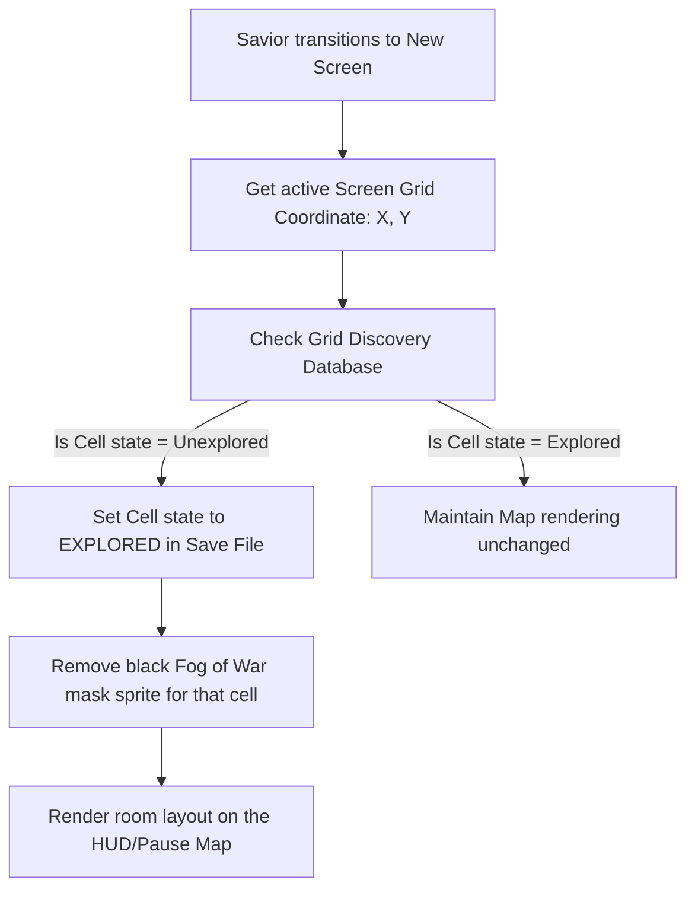
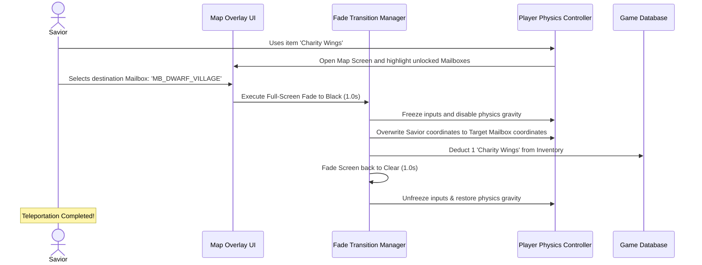

# World Map & Fast Travel System Specification
## Project: The Legacy of Tomba & the Evil Pigs' Curse

---

## 1. Introduction to Map & Navigation Systems (The Concept)

In large, non-linear adventure games (such as Metroidvanias), players frequently explore complex, looping paths and return to previously visited areas with new abilities.
* **The Problem (Backtracking Fatigue)**: Walking across the entire world repeatedly just to return to an earlier room can become boring and frustrating for the player.
* **The Solutions**:
  1. **The Map Screen**: A grid-based map that visualizes the layout of rooms, tracking the player's position in real time. To maintain mystery, unvisited rooms are hidden under a dark **Fog of War** until explored.
  2. **Fast Travel**: A mechanic that lets players teleport instantly across the world. In this game, players use **Charity Wings** (rare magical feathers) to fly instantly between unlocked **Mailbox Checkpoints** (safe resting hubs).

---

## 2. Fog of War & Grid Exploration Tracking

The map is structured as a coordinate grid where each cell ($1 \times 1$ block) represents a room screen. When the Savior enters a screen, the engine reveals that block on the map UI.



---

## 3. Fast Travel Mechanics (Charity Wings Sequence)

Fast travel is handled by a dedicated sequence that safely transitions the player's coordinate variables between two points inside the game database.



---

## 4. Map Coordinate Data Structure

The global world map layout is saved inside a simple $2D$ Boolean Array where each element represents the discovery state of a map block.

* **Database Array Layout**:
  * `0`: Cell is locked / Unvisited (Rendered as black fog).
  * `1`: Cell is unlocked / Visited (Rendered with environmental color borders).
  * `2`: Special Node (Displays specific icons like Mailboxes, Wise Men Cabins, or locked AP Chests).

```json
{
  "map_dimensions": { "width_cells": 16, "height_cells": 12 },
  "active_map_data": [
    [0, 0, 0, 0, 0, 0, 0, 0],
    [0, 0, 1, 1, 2, 1, 0, 0],
    [0, 0, 1, 0, 0, 1, 1, 0],
    [0, 0, 2, 0, 0, 0, 0, 0]
  ]
}
```

* **Grid Legend**:
  * Coordinate `[1, 4]` (Value `2`) displays the active Mailbox icon where fast travel is permitted.
  * Coordinate `[1, 2]` (Value `1`) renders the standard visited path of the *Dwarf Forest*.