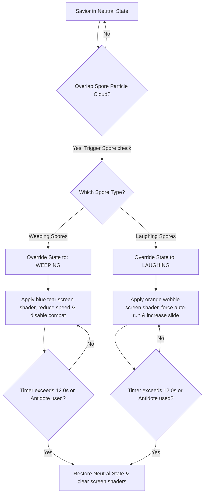

# Mushroom Affliction System (Laughing & Crying Status Effects)
## Project: The Legacy of Tomba & the Evil Pigs' Curse

---

## 1. Introduction to Emotional Afflictions (The Affliction Concept)

In most action games, character status effects are simple: being poisoned slowly drains health, or being frozen stops movement.
* **The Twist in Tomba's World**: The Savior is a wild, feral child of nature who reacts with raw, unfiltered emotion to his environment. The *Wailing & Laughing Forest* is filled with psychoactive mushrooms that emit emotional spores.
* **How it affects gameplay**: Inhaling or touching these spores does not hurt the Savior's physical health directly. Instead, it forces him into extreme, uncontrollable emotional states (**Laughing** or **Weeping**).
* **The Challenge**: While afflicted, the standard physical controllers are overridden. The Savior cannot attack or grab enemies normally, turning simple platforming areas into challenging, comical obstacle courses.

---

## 2. Affliction State Transition Pipeline

The Savior's central controller monitors contact with spore particles and handles the transition between emotional states.

---

## 3. Detailed Emotional State Specifications

### 3.1 The Laughing State (Hyperactive Chaos)
* **Emotional Behavior**: The Savior is overcome by uncontrollable laughter. He cannot stay still.
* **Input Modifications**:
  * *Forced Run*: The Savior runs forward constantly at $130\%$ of his standard speed ($11.0 \, \text{m/s}$). The player can only control his facing direction and jump inputs.
  * *High Slipping Friction*: Horizontal deceleration is reduced, causing the Savior to slide heavily when trying to stop, making it easy to slip off platforms.
* **VFX Screen Overlay**: The screen is tinted with a warm orange filter, and a subtle horizontal wave distortion (`SH_SCREEN_WOBBLE`) simulates a vibrating, giggling lens effect.
* **Audio Cue**: Continuous, high-pitched comical giggles play in sync with his jumps.

### 3.2 The Weeping State (Sorrowful Vulnerability)
* **Emotional Behavior**: The Savior is overwhelmed by deep sadness, crying uncontrollably and wiping tears from his eyes.
* **Input Modifications**:
  * *Depleted Speed*: Movement speed is reduced to $40\%$ ($3.4 \, \text{m/s}$).
  * *Heavy Jumps*: Maximum jump height is cut in half ($7.0 \, \text{m/s}$ force).
  * *Combat Disabled*: Standard weapons and physical grabs are locked. If the player presses the attack keys, the Savior simply executes a weeping animation frame, leaving him completely vulnerable to enemies.
* **VFX Screen Overlay**: The screen is tinted with a cold blue filter. A dynamic vertical water-drop shader (`SH_TEARDROP_FALL`) simulates transparent teardrops sliding down the player's screen.
* **Audio Cue**: The background music volume decreases by $40\%$, layered with continuous crying sounds.

---

## 4. Cleansing & Recovery (The Antidote System)

Emotional afflictions last for a default duration of $12.0 \, \text{seconds}$. However, players can clear the state instantly using two methods:

* **Herbal Antidotes**: Consuming an **Antidote Herb** (`IT_HERB_ANTIDOTE`) from the quick-select menu instantly resets the state back to `Neutral` and destroys active screen shaders.
* **Wise Men Blessings**: Ringing a Wise Man Bell near a sanctuary projection immediately purifies the Savior’s mental state, restoring standard physics.