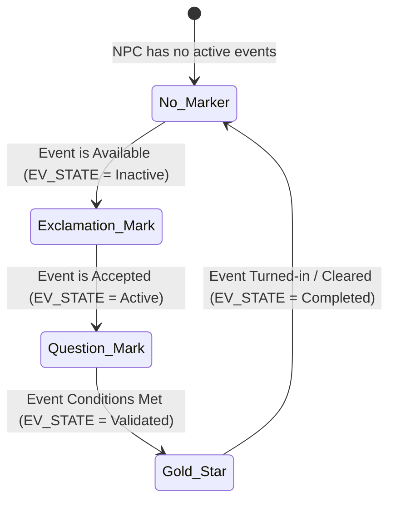
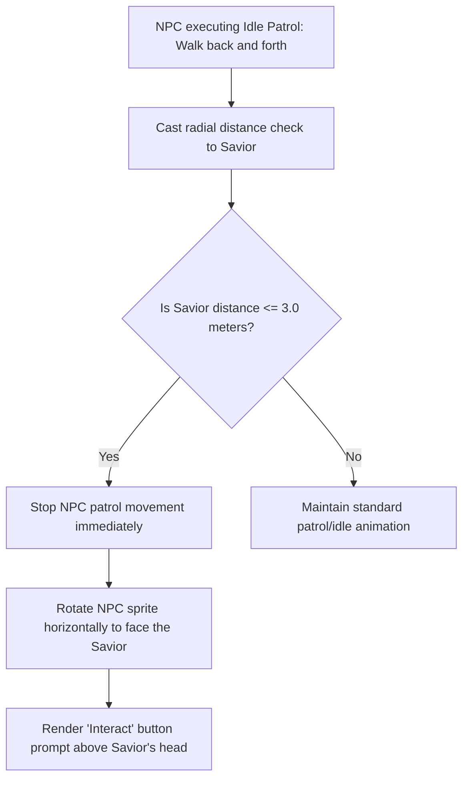

# NPC Quest Markers & Interactive Behaviors Specification
## Project: The Legacy of Tomba & the Evil Pigs' Curse

---

## 1. Introduction to NPC Interactions (The Quest Marker Concept)

In a world filled with over $100$ unique characters (such as Dwarves, Jungle Villagers, and ancient Wise Men), knowing who to talk to can be overwhelming.
* **The Problem**: If every character looks exactly the same, players are forced to talk to every single villager repeatedly just to find out if they have a new quest, leading to boredom and fatigue.
* **The Solution**: The game implements a **Dynamic Quest Marker System**. Interactive characters (NPCs) display floating, animated symbols above their heads that change in real time according to their active event state. This visually guides the player’s attention directly to where progress can be made.

---

## 2. Quest Marker State Machine

Every NPC's floating symbol is controlled by a state machine that queries the global Event Database (as specified in `event_and_progression_system.md`).

### 2.1 Marker Symbol Specifications
* **Exclamation Mark (`!`)**: A bouncing yellow symbol. Indicates a new, unaccepted event is available.
* **Question Mark (`?`)**: A static silver symbol. Indicates an event is active but the Savior has not yet completed all requirements.
* **Gold Star (`*`)**: A spinning golden star with particle sparkles. Indicates the Savior has completed the objectives; talking to the NPC now will clear the event and award AP.

---

## 3. NPC Proximity & Interaction Radius

NPCs do not stand completely rigid. To make the world feel alive, they run subtle idle animations and react physically when the Savior approaches.

### 3.1 Interaction Angle & Coordinate Snapping
* **Facing Vector**: The NPC checks the horizontal sign of the Savior's position relative to its own ($P_{\text{savior\_x}} - P_{\text{npc\_x}}$). If the value is negative, the NPC flips its sprite left; if positive, it flips right. This ensures eye-to-eye contact during dialogue.
* **Input Lock**: Pressing the *Interact* key disables standard platforming physics, snaps the Savior’s coordinates horizontally to face the NPC at a comfortable reading distance of $1.5 \, \text{meters}$, and opens the dialogue canvas.

---

## 4. NPC Movement Splines (Scripted Cutscenes)

During narrative cutscenes, NPCs must move across the screen to exit doors, run away in fear, or hand items to the Savior.
* **The Method (Movement Splines)**: NPCs ignore standard patrol AI and follow a smooth mathematical curve (a **Bezier Spline**) drawn inside the level editor.
* **Smooth Interpolation**: The engine moves the NPC’s physical coordinates along the spline path over a specified time, adjusting their skeletal bone animations (as specified in `2d_skeletal_animation_and_deformers.md`) to match their moving speed, preventing foot-sliding or robotic linear translations.