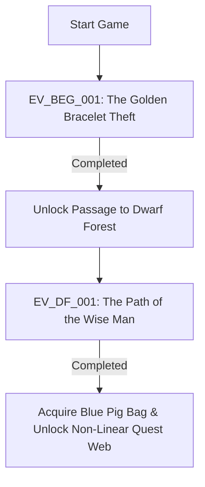
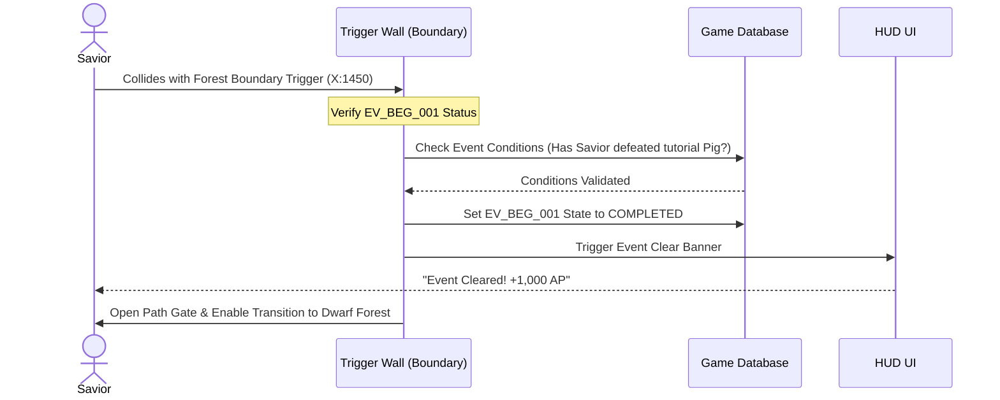

# Opening Events Script & Gameplay Flow
## Project: The Legacy of Tomba & the Evil Pigs' Curse

---

## 1. Sequence Map of Opening Events

The game starts with a highly directed sequence of events that introduce the player to the basic mechanics (movement, grabbing, and talking) before opening the non-linear exploration structures.



---

## 2. Event Specification: EV_BEG_001 (The Golden Bracelet Theft)

* **Event ID**: `EV_BEG_001`
* **Name**: The Golden Bracelet Theft
* **Location**: Beginnings Village (The Ancestral Grave)
* **Complexity Level**: Tutorial / Introductory

### 2.1 Trigger and Setup
The game begins with the Savior standing idle in front of his grandfather's grave. The player has full control of movement but cannot leave the screen boundaries. 

* **State Change**:
  * Entering the trigger zone `TR_GRAVE_01` (positioned exactly on the grave coordinates $X: 120, Y: 10$) suspends player input and initiates a real-time cinematic sequence.

### 2.2 Cinematic Sequence & Script
1. **Visual**: Three Koma Pigs jump from the background trees, landing on the foreground plane with a comical physical bounce. One of them is holding the Golden Bracelet.
2. **Audio**: Tension music track (`SFX_PIG_LAUGH`) plays.
3. **Dialogue**:

> **Koma Pig (Leader)**: *"Look what we found! This shiny gold will make excellent fuel for the master's magic! Squeee!"*

> **The Savior**: *"Grrr... My grandfather's bracelet! Put it down!"*

4. **Action**: The Koma Pigs run to the right, jumping through a fence block. The Savior is returned to the active gameplay state.
5. **HUD Update**: An on-screen UI prompt slides in: **"New Event Activated: The Golden Bracelet Theft"**.

### 2.3 Gameplay Phase
The player must navigate the path to the right, learning to jump over small gaps and use the basic *Grab and Throw* mechanic on a tutorial Koma Pig placed along the path.

### 2.4 Completion Conditions & Sequences



---

## 3. Event Specification: EV_DF_001 (The Path of the Wise Man)

* **Event ID**: `EV_DF_001`
* **Name**: The Path of the Wise Man
* **Location**: Dwarf Forest (Transition to Colina del Sabio)
* **Complexity Level**: Basic Platforming & NPC Interaction

### 3.1 Trigger and Setup
* **Prerequisites**: `EV_BEG_001` must be marked as `Completed`.
* **Activation**: This event is automatically initialized when the player crosses the threshold into the Dwarf Forest screen ($X: 0, Y: 100$). The player log updates with the objective: *"Seek the Wise Man on the hill."*

### 3.2 Walkthrough Path
1. The Savior traverses the foggy platforms of the Dwarf Forest.
2. At coordinates $X: 800$, the Savior meets the **Dwarf Elder**, who is standing in front of a locked wooden gate.
3. **Dialogue**:

> **Dwarf Elder**: *"You seek the Wise Man? His hut is just above us on the hill, but the fog is too thick. Take this old path, climb the vertical vines, and you will find his cabin. Be careful, the pigs have placed cursed barriers!"*

4. The player must jump onto the vertical vine assets on the background layer (using the Z-axis switch) and climb up to the cabin entrance trigger.

### 3.3 The Wise Man's Cabin Encounter
Entering the cabin triggers an interior screen swap. The Savior meets the **100-Year Wise Man**, who is hovering cross-legged in the center of the room.

```
       [ 100-Year Wise Man's Hut Interior ]
  ==============================================
   [Window]                               [Exit]
                    (Wise Man)
                      - - -
                       - -
                     [Table]
                                 (Savior)
  ==============================================
```

* **Dialogue**:

> **100-Year Wise Man**: *"Ah, wild savior. I have felt the disruption of the elements. The Evil Pigs are using the stolen gold to anchor their curses onto our lands. Your grandfather's bracelet is gone, but it can be retrieved if you purify the world."*

> **The Savior**: *"How do I stop them? Their magic is too strong!"*

> **100-Year Wise Man**: *"You must trap their physical forms inside these sacred vessels. Here, take the first Blue Pig Bag. It is aligned with the magic of the Forest Lieutenant. Find his portal and seal him away!"*

### 3.4 Event Resolution & Rewards
* **Action**: The 100-Year Wise Man drops the physical **Blue Pig Bag** asset. The player must walk over it and press the Interact key.
* **Database Updates**:
  * Set `EV_DF_001` to `Completed`.
  * Set item inventory flag `IT_PIG_BAG_BLUE` to `True`.
  * Award $+2,000 \, \text{AP}$ to the player's active balance.
  * Unlock the world state flag `is_dwarf_forest_fully_explorable`, allowing the player to search for the Blue Pig's portal and accept non-linear quests from other dwarves.