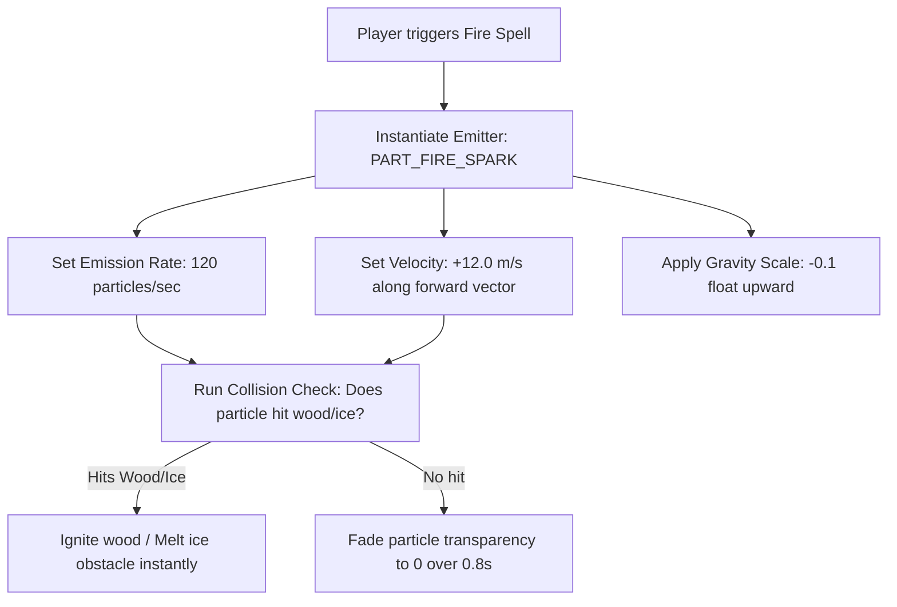
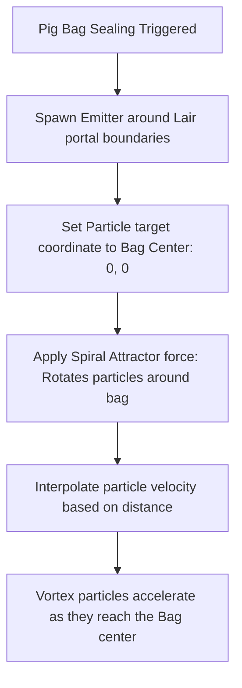

# Particle FX & Elemental Spells Specification
## Project: The Legacy of Tomba & the Evil Pigs' Curse

---

## 1. Introduction to Particle FX (The Magic Dust Concept)

In video games, dynamic visual effects like roaring fire, running water streams, glowing magical wind, or exploding dust clouds cannot be animated easily using standard frame-by-frame drawings.
* **The Concept**: These effects are created using a **Particle System**. A particle system acts like a high-speed sprinkler, shooting out hundreds of tiny flat drawings (**Particles**) into the air. 
* **The Controls**: By giving each particle its own life span (how long it exists before disappearing), velocity (speed and direction), and gravity scale (whether it falls to the ground or floats into the sky), the computer combines them to create beautiful, realistic natural or magical flows.
* **Why it matters**: Particle FX provide critical visual clarity. When the player casts an elemental spell, the sparks and waves tell them exactly where the magic is hitting and what elements are active in combat.

---

## 2. Elemental Jewel Magic (Fire & Water Spells)

By equipping the *Elemental Jewels of Power*, the Savior can channel elemental magic. These spells are simulated using specialized physical particle emitters.

### 2.1 Fire Spell: Blazing Sparks (`PART_FIRE_SPARK`)
* **Aesthetic**: Hot, glowing red and orange embers erupting from the Savior's hands.
* **Technical Parameters**:
  * *Emitter Type*: Cone shape ($25^\circ$ angle for directed forward blast).
  * *Lifetime*: $0.6$ to $0.8 \, \text{seconds}$.
  * *Size Over Lifetime*: Starts at $0.8 \times$ scale, shrinking down to $0.1 \times$ before disappearing.
  * *Color Over Lifetime*: Blends from pure white-hot (`#FFFFFF`) to deep fiery red (`#FF0000`).

### 2.2 Water Spell: Cleansing Wave (`PART_WATER_STREAM`)
* **Aesthetic**: A dense, fluid stream of crystal-blue water bubbles.
* **Gameplay Utility**: Douses burning geysers and cools down hot volcanic stone inside *Phoenix Mountain*.
* **Technical Parameters**:
  * *Gravity Scale*: $1.2$ (Water particles follow a natural falling arc).
  * *Damping (Air Friction)*: $2.5$ (Particles slow down quickly in the air, limiting range to $4.5 \, \text{meters}$).

---

## 3. Sealing Magic Vacuum Particles (The Vortex Flow)

During the boss sealing climax (as specified in `pig_capturing_and_portal_mechanics.md`), the magical pull of the Pig Bag is reinforced visually by a **Spiral Particle Vortex**.

* **Vortex Attractor Calculation**: Emitted spark particles are forced along a spiral path toward the bag center coordinate. The velocity magnitude ($v$) increases exponentially as the particle’s distance ($r$) to the bag decreases:

$$v = \frac{\text{AttractionConstant}}{r^2}$$

* **Visual Sensation**: This mathematical pull creates a vortex where hundreds of colorful sparks rotate around the Evil Pig, speeding up as they dive into the open bag, visually conveying the immense magical gravity of the seal.

---

## 4. Draw Call Batching & GPU Optimization

Renderizing hundreds of active particles can overwhelm mobile or portable console graphics cards, causing performance lag.
* **Particle Batching**: All active particles within the same system are compiled into a single unified grid mesh (**GPU Instance Batching**). This reduces the rendering cost from hundreds of individual instruction calls down to a single draw call.
* **Alpha Clipping**: Particle materials use $8\text{-bit}$ binary transparency masks instead of heavy soft-blending alpha channels on low-end hardware (like the Nintendo Switch), keeping performance locked at a smooth, stable $60 \, \text{fps}$.