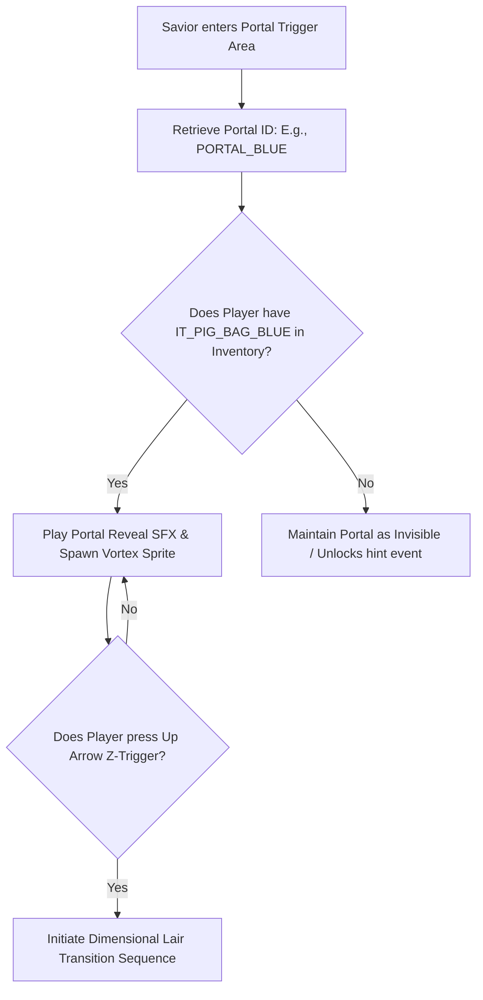
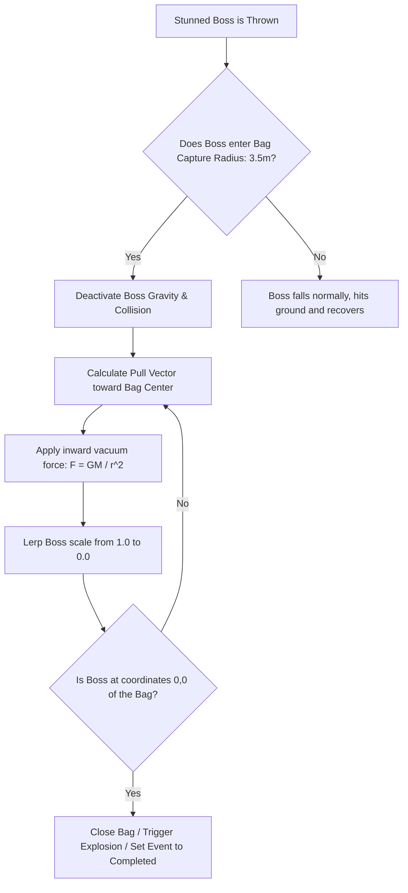

# Pig Capturing Alchemy & Portal Mechanics Specification
## Project: The Legacy of Tomba & the Evil Pigs' Curse

---

## 1. Introduction to Pig Portals (The Dimensional Concept)

In this game world, the Seven Evil Pigs do not live in standard houses or caves. Because of their dark magic, they have warped reality and constructed hidden pocket dimensions called **Lairs**.
* **What is a Lair?**: A small, isolated parallel dimension customized to match the Pig Lieutenant's magic (e.g., a fiery volcanic room for the Fire Pig).
* **How to enter**: The portals leading to these lairs are invisible in the real world. To expose and activate a portal, the Savior must stand in the correct coordinates carrying the corresponding **Magic Pig Bag** in his inventory. 
* **The Goal**: This document details the programmatic gatekeeping of portals, the visual screen transitions, and the physical vacuum forces that pull a boss into the bag during the sealing climax.

---

## 2. Portal Detection & Key Verification Flow

When the Savior approaches a portal site, the engine runs a check on the inventory system to determine if the portal should render and become interactive.

---

## 3. Dimensional Lair Transition Sequence

Entering a portal triggers an immersive visual sequence designed to convey the sensation of tearing through physical space.

### 3.1 Step-by-Step Transition Protocol
1. **Input Suspension**: Player input is locked; the Savior is placed in an automated "Floating" animation frame.
2. **Vortex Shader Activation**: A full-screen warp shader is activated. This shader distorts the screen pixels radially toward the portal's center coordinate over $1.5 \, \text{seconds}$, creating a liquid spiral tunnel effect.
3. **Sound Shift**: Background music fades out, replaced by a low-frequency dimensional hum (`SFX_SYS_PORTAL_VORTEX`).
4. **Scene Load**: The engine asynchronously unloads the active world region and loads the designated Boss Lair scene inside the RAM.

---

## 4. Sealing Physics (The Vacuum Vector Loop)

Capturing a boss is not calculated by a simple collision check. Once the Savior throws a stunned Evil Pig within the capture radius of the floating Pig Bag, the physics engine takes over, overriding standard gravity to execute a vacuum pull.

### 4.1 The Vacuum Force Equation
While inside the capture radius ($3.5 \, \text{meters}$), a continuous pulling force ($\vec{F}_{\text{vacuum}}$) is applied to the boss’s position ($P_{\text{boss}}$) directed toward the floating Bag’s center coordinate ($C_{\text{bag}}$):

$$\vec{F}_{\text{vacuum}} = \frac{G \times M}{(C_{\text{bag}} - P_{\text{boss}})^2} \times \vec{u}$$

Where:
* $G$ is a custom gravitational pull constant ($15.0$).
* $M$ is the simulated "mass" of the magic black hole inside the bag.
* $\vec{u}$ is the normalized direction vector pointing from the boss to the bag center.
* **Visual Shrinking**: As the distance decreases to $0.1 \, \text{meters}$, the boss’s sprite scale is linearly interpolated (*Lerped*) down to $0.0$, visually simulating the boss being sucked inside the pouch.