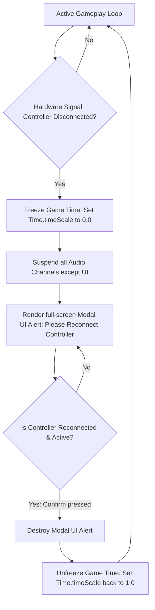
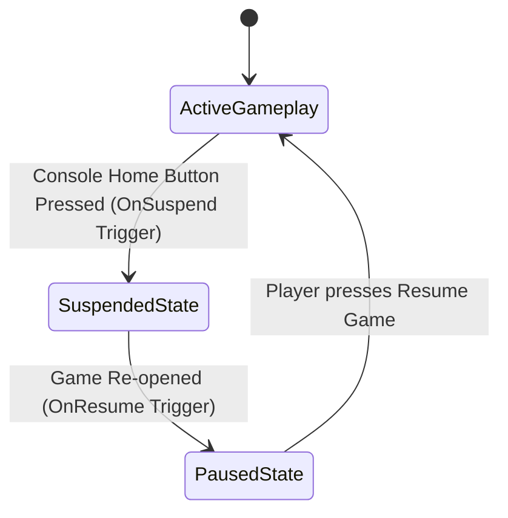

# Platform Certification & Deployment Compliance Specification
## Project: The Legacy of Tomba & the Evil Pigs' Curse

---

## 1. Introduction to Console Certification (The Compliance Concept)

Before a video game can be sold digitally on consoles (such as the Nintendo Switch, PlayStation 5, or Xbox Series X/S), it must pass a highly rigorous auditing process called **Console Certification**.
* **Why it exists**: Console manufacturers (Nintendo, Sony, Microsoft) want to guarantee that no game crashes their console operating systems, freezes during run states, or violates basic user expectations.
* **The Checklists**: Each platform has its own set of rules—Sony calls them **TRC (Technical Requirements Checklist)**, Microsoft calls them **XR (Xbox Requirements)**, and Nintendo calls them **Lotcheck**. 
* **The Consequences**: If a game violates even a single minor rule (e.g., failing to pause when a controller runs out of battery), the certification is rejected, delaying release and incurring substantial resubmission costs.

---

## 2. Controller Disconnection Handling (The Pause Requirement)

One of the most common certification failure points is improper handling of physical hardware disconnections.



### 2.1 UI Modal Requirements
* **Text Specification**: The prompt must explicitly state which player’s controller is disconnected (e.g., *"Player 1 controller disconnected. Please reconnect a controller and press the [Confirm] button to resume."*).
* **Language Match**: This system message must dynamically translate to match the console’s active hardware system language (fully supporting our localization matrix).

---

## 3. Console Suspend & Resume Cycle

When a player presses the console’s hardware *Home Button*, the console forces the game into a **Suspended State** to free up system resources. The engine must handle this transition gracefully without corrupting memory or network connections.



### 3.1 OnSuspend and OnResume Rules
* **`OnSuspend` Event**:
  * Instantly pauses the physics engine tick.
  * Silences all active game audio channels (to prevent game music from playing while browsing the console main menu).
  * Auto-saves the player's position data to the rotating quicksave slot to prevent data loss in case the console is shut down completely.
* **`OnResume` Event**:
  * Awakens the game engine, but keeps active gameplay paused.
  * Forces the player into the standard **Pause Menu Screen** (this prevents the player from immediately taking damage or dying if they minimized the game in a dangerous room).

---

## 4. UI safe-Zone Boundaries

Many home television screens apply a hardware process called **Overscan**, which slightly stretches and crops the outer edge ($5\%$ to $10\%$) of the video signal.

* **The Problem**: If HUD elements (like the Savior's Vitality Bars or active AP counters) are placed exactly on the pixel edges of a $1920 \times 1080$ coordinate grid, they will be cropped out on overscan televisions.
* **The Solution**: The UI framework implements a **Safe-Zone Margin**.

```
  +-------------------------------------------------------------+
  |  [SCREEN AREA: 1920 x 1080]                                 |
  |  +-------------------------------------------------------+  |
  |  |  [SAFE-ZONE AREA: 5% Inner Margin]                    |  |
  |  |  + (HUD Vitality)                       (AP Counter) +|  |
  |  |                                                       |  |
  |  |                                                       |  |
  |  |                                                       |  |
  |  |  + (Selected Item)                                   |  |
  |  +-------------------------------------------------------+  |
  +-------------------------------------------------------------+
```

* **Safe Margin Constant**: All primary informational text, buttons, and status icons must remain locked within the inner $90\%$ boundary of the active display viewport. This guarantees $100\%$ visibility across all display hardware types.