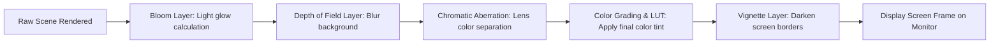
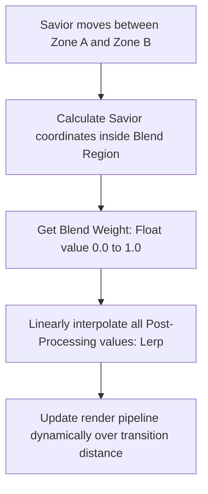

# Post-Processing & Camera Volume Profiles Specification
## Project: The Legacy of Tomba & the Evil Pigs' Curse

---

## 1. Introduction to Post-Processing (The Photographic Concept)

When a game engine renders a $3\text{D}$ or $2\text{D}$ scene, the raw output can often look flat and digital. 
* **The Concept**: To achieve a rich, atmospheric, and highly cinematic look, games apply a layer of digital lenses and color filters called **Post-Processing**. 
* **How it works**: Once the camera captures the level coordinates, but milliseconds before the frame is drawn on the player's monitor, a specialized shader program manipulates the pixels, adding effects like glowing lights, blurred backgrounds, darkened corners, and professional color grading.
* **Why it matters**: Post-processing is the main tool used to establish the psychological tone of each biome. Cursed areas feel cold, toxic, and high-contrast, while purified areas feel warm, glowing, and welcoming.

---

## 2. Post-Processing Pipeline Layering

The rendering camera routes the screen frame through a sequence of shader filters before displaying the final output.

---

## 3. Post-Processing Parameter Definitions

These filters are applied using a **Camera Volume Profile** component:

* **Bloom**: Simulates the light bleed of bright sources, creating a soft, glowing halo around fire, portals, and magical items.
* **Vignette**: Gradually darkens the outer borders of the screen. This guides the player’s focus toward the center action and creates a claustrophobic feeling inside dark caves.
* **Chromatic Aberration**: Mimics real-world camera lens distortion by slightly separating red, green, and blue light channels along high-contrast edges. Used inside cursed rifts to simulate dimensional instability.
* **Color Grading & LUT (Lookup Table)**: Re-maps the colors of the entire screen using a specific color palette matrix, changing the overall mood (e.g., cold blue or warm golden-green).

---

## 4. Master Volume Profile Configurations

Each major biome has a unique post-processing configuration that changes dynamically when the regional curse is broken.

### 4.1 Dwarf Forest Profiles

| Parameter Filter | Cursed Forest Volume | Purified Forest Volume | Technical Purpose |
| :--- | :--- | :--- | :--- |
| **Color Temp** | Cold ($-35.0$ value) | Warm ($+12.0$ value) | Cold blue represents pig corruption; warm golden represents nature. |
| **Bloom Intensity** | $3.5$ (High, unstable violet glow) | $1.2$ (Soft, natural sunlight glow) | Violet represents volatile portal magic; soft gold represents sunlight. |
| **Vignette** | $0.45$ (Heavy dark borders) | $0.15$ (Subtle, open view) | Creates claustrophobia inside cursed mist; opens up the view when clean. |
| **LUT Palette File** | `LUT_DF_CURSED_COLD.png` | `LUT_DF_NATURAL_WARM.png` | Swaps the global color mapping texture sheet dynamically. |

### 4.2 Haunted Mansion Profiles

| Parameter Filter | Cursed Mansion Volume | Purified Mansion Volume | Technical Purpose |
| :--- | :--- | :--- | :--- |
| **Contrast Scale** | High ($+35\%$) | Neutral ($0\%$) | High contrast deepens shadows; neutral restores normal visibility. |
| **Chromatic Aberration**| $0.65$ (High warp distortion) | $0.05$ (Barely visible) | Simulates gravitational and dimensional warping inside the mansion. |
| **Depth of Field** | Blur start: $5.0 \, \text{m}$ (Blurry BG) | Blur start: $15.0 \, \text{m}$ (Clear BG) | Keeps the background blurred to focus attention on inverted gravity ceiling platforms. |

---

## 5. Dynamic Profile Blending (Transition Zones)

When the Savior transitions between different biomes (e.g., walking out of the bright *Beginnings Village* and into the foggy *Dwarf Forest*), the screen must not pop instantly to the new color profile. The engine utilizes **Dynamic Volume Blending**.

### 5.1 The Blending Interpolation (Lerp)
The blend weight ($W$) is calculated based on the Savior's position relative to the boundaries of the intersection zone ($10.0 \, \text{meters}$ wide):

$$\text{ActiveValue} = \text{Lerp}(\text{ProfileA}_{\text{value}}, \text{ProfileB}_{\text{value}}, W)$$

This mathematical interpolation ensures that as the Savior walks through the forest gates, the sky transition is beautifully smooth and seamless, slowly shifting the screen from bright, warm sunbeams to cold, heavy purple haze over the course of a few footsteps.