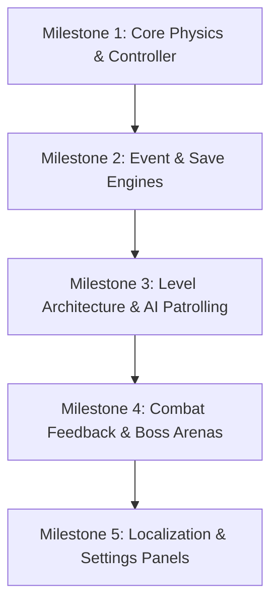

# Production Roadmap & Development Milestones
## Project: The Legacy of Tomba & the Evil Pigs' Curse

---

## 1. Introduction to Game Production (The Roadmap Concept)

Building a video game is a complex, multi-year process involving artists, programmers, writers, and designers. 
* **The Danger (Feature Creep)**: Without a strict schedule, a team can easily lose focus, adding too many minor ideas and never actually finishing the core game.
* **The Solution**: The project is organized into structured stages called **Milestones**. Each milestone has a clear, unyielding list of deliverables. This allows the team (and potential publishers/investors) to evaluate the game's progress and stability step-by-step.

---

## 2. Feature Dependency Rollout Map

Certain systems cannot be built until their core dependencies are programmed. The architecture follows a strict sequence of integration:

---

## 3. Standard Production Milestones & Deliverables

The development timeline is divided into five industry-standard milestones.

### 3.1 Milestone Breakdown Matrix

| Milestone Name | Estimated Duration | Core Deliverables (What is built?) | Target Goal for Newcomers |
| :--- | :--- | :--- | :--- |
| **1. First Playable Prototype** | Month $1$ to $2$ | Standard physics controls (running, jumping, basic grabbing), grey-box test level. | Prove that the core movement and throwing mechanics are fun to play in their rawest form. |
| **2. Vertical Slice** | Month $3$ to $5$ | $1$ fully polished, final-art area (Beginnings Village), $1$ boss fight, basic UI HUD, and $2$ completed events. | Create a $10$-minute playable demo representing the absolute final graphical and audio quality of the game. |
| **3. Alpha State** | Month $6$ to $9$ | All remaining regions mapped, all $130$ and $137$ events integrated, save file encryption. | "Feature Complete". The entire game can be played from beginning to end, but remains unpolished and contains bugs. |
| **4. Beta State** | Month $10$ to $11$| Localizations (English, Spanish, Japanese), settings panel fully functional, QA automated test suites. | "Content Freeze". No new features are added. The team focuses $100\%$ on squashing bugs and optimizing performance. |
| **5. Gold Master** | Month $12$ | Compilation of launch-ready binary files, platform store submissions (Steam, Nintendo Portal). | The final, certified build of the game is approved and prepared for global digital distribution. |

---

## 4. Production Gantt Timeline Visualizer

The planned resource scheduling maps out the simultaneous efforts of different team departments across the $12$-month production timeline.

```mermaid
gantt
    title Video Game Production Timeline (12-Month Schedule)
    dateFormat  X
    axisFormat Month %s

    section Tech & Programming
    Prototype Physics & Controls  :active, 0, 2
    Event & Save Systems Setup   : 2, 4
    UI/UX & Shop Implementation  : 4, 7
    Optimization & Bug Squashing : 7, 11
    Gold Master Certification     : 11, 12

    section Art & Animation
    2D Sprite Sheets & Rigs      :active, 0, 4
    Tilesets & Level Building    : 3, 8
    VFX Shaders & Particles      : 6, 9
    UI Polish & Dialogue Assets  : 9, 11

    section Narrative & Sound
    Dialogue Writing & Scripting : 1, 5
    Sound FX Design & Vocals     : 3, 7
    Adaptive Music Composition   : 5, 9
    Localization Integration     : 8, 11
```

---

## 5. Post-Launch Operations & Maintenance (Hotfixes)

Once the game is released, the production team transitions into **Live Operations** mode.
* **Bug Tracking**: Telemetry systems monitor crash reports from players.
* **Hotfix Pipeline**: Minor visual or performance bugs are compiled into lightweight updates called **Patches**. These are pushed to Steam or Console portals automatically without disrupting the active player bases, ensuring long-term maintenance and stability of the product.