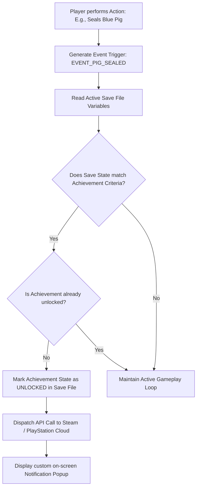
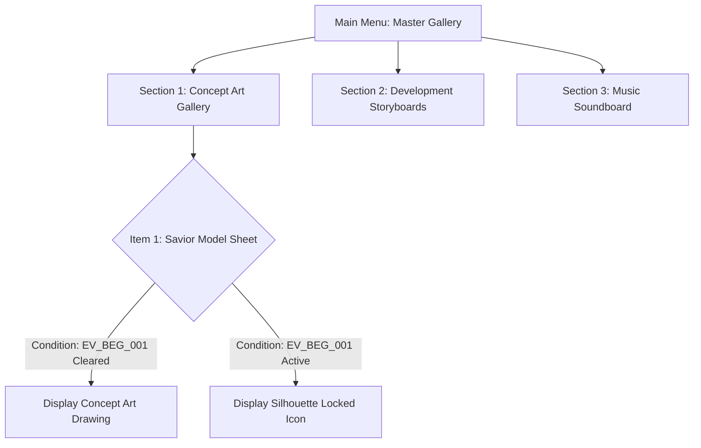

# Progression, Achievements & Unlockables Specification
## Project: The Legacy of Tomba & the Evil Pigs' Curse

---

## 1. Introduction to Achievement Systems (What is this?)

In modern game design, **Achievements** (also known as **Trophies** on PlayStation or **Gamerscore** on Xbox) are digital badges of honor awarded to players for completing specific tasks, challenges, or milestones within the game. 
* **The Purpose**: They keep players motivated, encourage exploration of secret areas, and reward highly skilled feats (such as completing the game without taking damage or collecting $100\%$ of hidden relics).
* **Technical Interaction**: The game does not work alone; it must talk to external gaming platforms (like Steam or Xbox Live) using software connectors called **APIs (Application Programming Interfaces)**. When the game detects that a player completed a task, it sends a secret code to Steam, which triggers the classic popping sound and visual notification on the player's screen.

---

## 2. Achievement Verification Pipeline

The achievement engine runs in the background. It monitors actions and compares them against the player's save file database.

---

## 3. Master Achievement Database (Core Trophies)

The game features $10$ core trophies designed to guide players through both standard progression and deep end-game secrets.

| Achievement ID | Public Title | Unlock Criteria (Details for Scripters) | Platform Icon Asset Path |
| :--- | :--- | :--- | :--- |
| **`ACH_FIRST_STEP`** | **The Quest Begins** | Cleared event `EV_BEG_001` (Golden Bracelet recovered from initial Koma Pigs). | `docs/assets/art/ui/icons/ach_01.png` |
| **`ACH_PORK_CHOP`** | **First Capture** | Captured and sealed the first Evil Pig Lieutenant in its magic bag. | `docs/assets/art/ui/icons/ach_02.png` |
| **`ACH_AP_CENTURION`** | **Vast Wealth** | Accumulated a balance of $\ge 100,000$ active Adventure Points (AP). | `docs/assets/art/ui/icons/ach_03.png` |
| **`ACH_SAVIOR_ERA_1`**| **Legend of the Forest** | Defeated and sealed the Supreme Real Evil Pig, completing the First Era. | `docs/assets/art/ui/icons/ach_04.png` |
| **`ACH_HERO_UNBOUND`** | **Master Athlete** | Unlocked both the *Animal Dash* and *Abyssal Diving* movement states. | `docs/assets/art/ui/icons/ach_05.png` |

---

## 4. The Master Unlockable Gallery System

To reward players who deeply engage with the world's lore, completing events generates **Art Tokens**. These tokens are used in the main menu to unlock high-definition game development assets.

### 4.1 Unlockable Gallery Layout Specification
When players open the "Master Gallery" in the main menu, they see a grid of frames.
* **Locked Frames**: Displayed as a dark silhouette containing a padlock icon and a clear instruction text: *"To unlock this memory, you must complete the Dwarf Forest main event chain."*
* **Unlocked Frames**: Shows the raw hand-drawn character and level art created during production (such as the actual high-definition conceptual art of the *Haunted Mansion* or the *Water Temple depths*), offering players a rewarding peek behind the curtain of the game's creation.