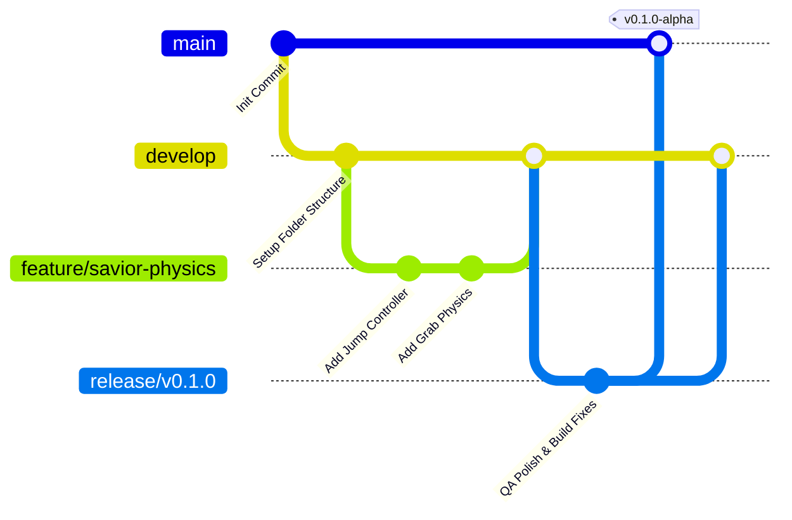

# Project Structure & Repository Setup Specification
## Project: The Legacy of Tomba & the Evil Pigs' Curse

---

## 1. Repository Directory Map

To prevent broken asset references, lost scripts, and folder clutter as the project expands, the repository follows a strict, standardized directory layout. This structure is universally compatible with modern component-based engines (such as Unity or Godot).

```mermaid
graph TD
    A[Project Root] --> B[/assets]
    A --> C[/src]
    A --> D[/docs]
    A --> E[/builds]
    
    B --> B1[/art]
    B --> B2[/audio]
    B --> B3[/scenes]
    
    C --> C1[/scripts]
    C --> C2[/database]
    
    D --> D1[/phase_1_conceptualization]
    D --> D2[/phase_2_detailed_design]
```

### 1.1 Detailed Directory Specifications

* **`/assets`**: Stores all raw and imported graphic, audio, and scene binary assets.
  * `/docs/assets/art/key_art`: Game covers, promotional splash screens.
  * `/docs/assets/art/characters`: Hero and enemy sprites, sprite sheets, skeletal animation rigs.
  * `/docs/assets/art/environments`: Level parallax textures, terrain tiling matrices, post-processing profiles.
  * `/docs/assets/art/ui`: Cursor indicators, HUD meters, inventory icons, dialogue boxes.
  * `/Assets/audio/music`: Separate channels for Cursed and Purified looping tracks.
  * `/Assets/audio/sfx`: Exertion grunts, weapon swings, UI clicks, impact sweeps.
  * `/Assets/scenes`: Physical level layouts, trigger zone bounds, and camera coordinates.
* **`/src`**: Contains game scripts, code modules, databases, and configuration JSON assets.
  * `/src/scripts/character`: Savior physics, dynamic inputs, state controllers.
  * `/src/scripts/events`: Event engine state machine, event data tables.
  * `/src/scripts/camera`: Camera bounding zones, parallax calculations, transition lerp handlers.
  * `/src/scripts/ui`: Typewriter text printing, inventory layouts, HUD updates.
  * `/src/database`: Localization CSV files, dialog node dictionaries, saving systems.
* **`/docs`**: Complete technical and design documentation suite.
* **`/builds`**: Target folders for compiled releases (PC, Nintendo Switch). Always ignored by the version control system.

---

## 2. Version Control & GitFlow Strategy

To support collaborative development, developers must isolate changes inside specialized branch pipelines, preventing direct conflicts with the main release branch.



### 2.1 Branch Classification Rules
* **`main`**: Locked branch representing production-ready, stable releases. Code can only enter `main` via formal merge requests from `release/*` or `hotfix/*` pipelines.
* **`develop`**: The primary working environment branch where all current development is integrated and tested by the QA automated build pipeline.
* **`feature/*`**: Temporary local branches created to develop a single task (e.g., `feature/dialogue-typing`, `feature/blue-pig-ai`). Merged back into `develop` once tests pass.
* **`release/*`**: Stabilization branch created before milestones to perform polish, localize texts, and run manual QA tests.
* **`hotfix/*`**: Emergency pipelines used to correct major blocking issues found in active production builds.

---

## 3. Project .gitignore Blueprint

Certain engine system caches, local user settings, and compiled binaries must never be uploaded to the version control system. This ensures fast repository synchronizations and prevents binary data corruption during team merges.

```ini
# ==========================================
# Version Control Exclusion Blueprint
# ==========================================

# 1. Builds and Compiled Outputs
/builds/
*.apk
*.exe
*.app
*.dmg

# 2. Local User Configuration & Editor Caches
.vs/
.idea/
.vscode/
*.suo
*.user
*.userprefs
*.workspace

# 3. Game Engine Generated Temp Directories (Unity/Godot)
/[Ll]ibrary/
/[Tt]emp/
/[Oo]bj/
/[Bb]uild/
/[Gg]enerated/
.mono/
.import/
*.csproj
*.sln

# 4. OS Specific Junk Files
.DS_Store
Thumbs.db
```