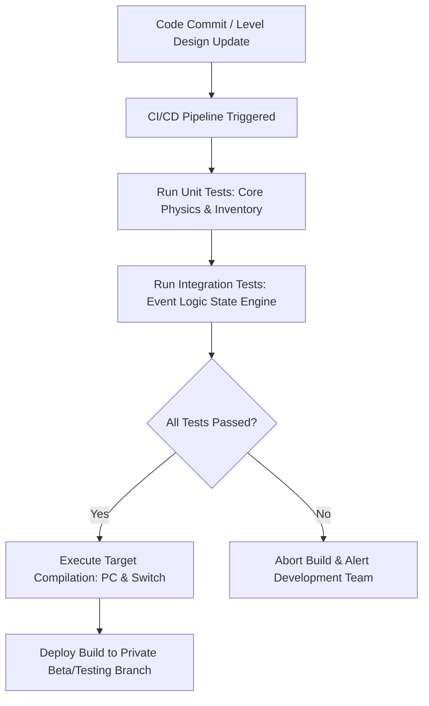
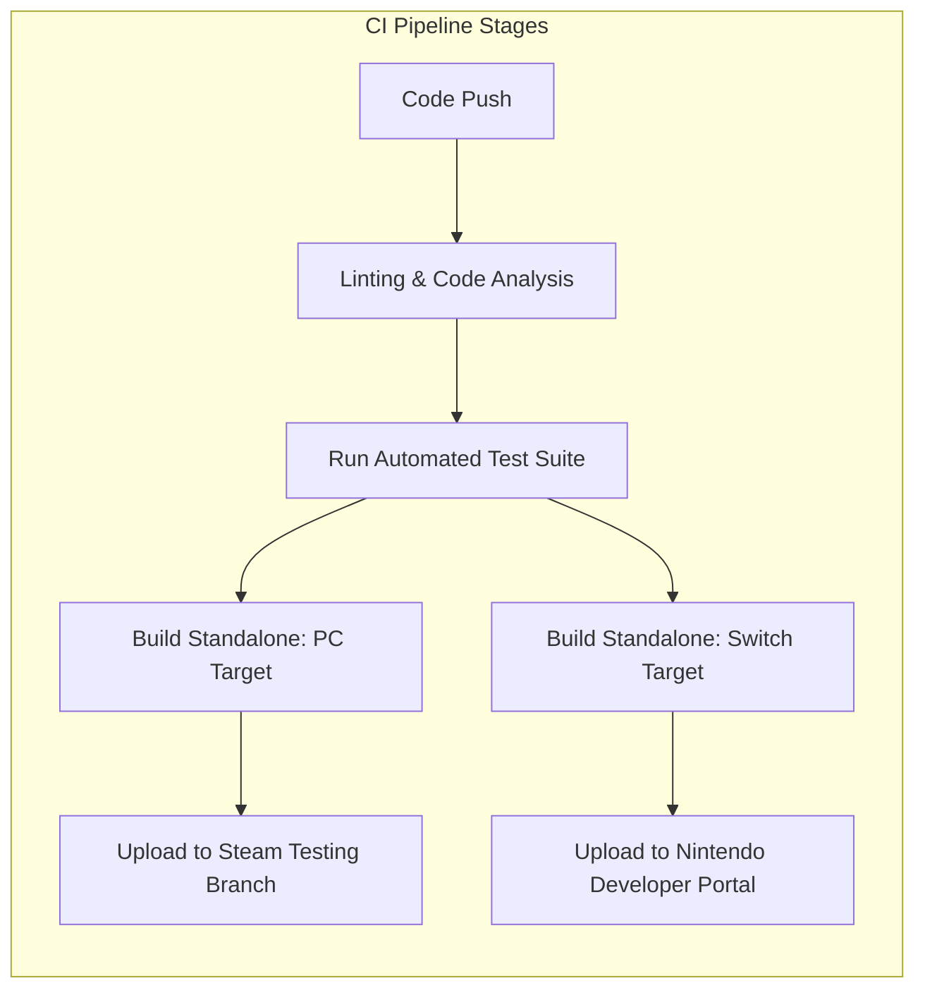

# QA Testing Plan & Build Automation Specification
## Project: The Legacy of Tomba & the Evil Pigs' Curse

---

## 1. Testing Philosophy in a Non-Linear Game

Testing a Metroidvania-style game with over 130 interconnected events requires shifting from linear pass/fail validation to a **State-Matrix Verification Model**. Because the order in which players solve events is highly dynamic, tests must confirm that event resolutions do not break the dependency logic of other active or inactive events.

---

## 2. Automated Integration Test Suite

The QA framework executes automated headless simulation tests (running without rendering graphics to maximize speed) to validate core character physics and event handling rules.

### 2.1 Core Mechanical Test Cases

| Test Case ID | Target System | Input Simulation | Expected Output Verification |
| :--- | :--- | :--- | :--- |
| **TC_PHY_001** | Jump Controller | Inject Jump Input held for $15 \, \text{frames}$ | Savior height reaches $3.2 \, \text{meters} \pm 5\%$ and descends to baseline level. |
| **TC_PHY_002** | Coyote Time | Inject Move off ledge, then Jump Input after $80 \, \text{ms}$ | Savior initiates jump transition successfully despite leaving ground plane. |
| **TC_SAV_001** | Serialization | Trigger Save Game with active inventory and 3 completed events | Write binary data, read back, and verify properties match original payload. |
| **TC_EV_001** | Event Engine | Set `EV_BEG_001` to `Completed`, then check Dwarf passage collision | Collision mesh `COL_GATE_DWARF` changes status from `True` (Solid) to `False` (Trigger). |

---

## 3. Continuous Integration & Compilation (CI/CD) Pipeline

To avoid manual building errors, the pipeline compiles and verifies target builds automatically using cloud servers (e.g., GitHub Actions, Jenkins).

### 3.1 Build Output Optimization Rules
* **Stripped Debug Logs**: Production/Release compilations must have all performance-heavy diagnostic logs (`Debug.Log`, print statements) stripped from the runtime environment to maximize frame rates on console targets.
* **Asset Bundling Verification**: The compiler checks that all sprites inside the `docs/assets/art/` folder are successfully packeted into their compressed atlas sheets, warning developers if any texture lies orphaned.

---

## 4. Bug Classification & Priority Matrix

Bug tickets generated by manual QA testers are categorized based on their impact on game progression and physical stability.

* **Blocker (P1)**: Causes application crashes, platform certification failures, or hardlocks where the Savior is permanently trapped with no path to proceed.
  * *Required Action*: Stop all development tasks; hotfix must be deployed immediately.
* **Critical (P2)**: A major event or primary mechanic (e.g., throwing or Z-axis leaping) fails to trigger, stopping main story progression, but the app does not crash.
  * *Required Action*: Must be resolved before the current weekly sprint sprint closes.
* **Major (P3)**: Minor side quests cannot be triggered, or collision issues allow access to secret areas without the required progression relics.
  * *Required Action*: Added to the regular bug backlog to resolve before public beta milestones.
* **Minor (P4)**: Minor cosmetic visual bugs (e.g., clipping grass sprites, overlapping UI text boxes in Japanese localization).
  * *Required Action*: Fixed during regular aesthetic polish passes.