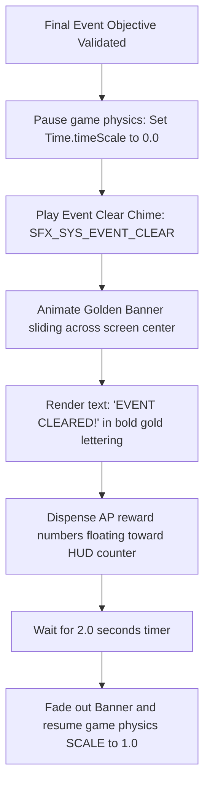

# Quest Log & Event Tracker UI Specification
## Project: The Legacy of Tomba & the Evil Pigs' Curse

---

## 1. Introduction to Event Tracking (The Logbook Concept)

In a non-linear game containing up to $130$ distinct tasks (Events) in the first era, keeping track of what needs to be done is a major challenge for the player.
* **The Problem**: If a player talks to a Dwarf, gets a clue about a lost key, and then stops playing for a week, they will likely forget the clue when they return, leading to confusion and frustration.
* **The Solution**: The game implements an **Event Journal & Quest Log Screen**. This interface catalog is accessible via the Pause Menu, automatically recording every active, completed, and discovered event, complete with sub-objectives, NPC hints, and progression percentages.

---

## 2. Event Log Screen Layout & Interface Specs

The Event Log UI is divided into three functional areas inside a normalized $1920 \times 1080$ viewport coordinate space.

```
  +-------------------------------------------------------------+
  |                         EVENT LOG                           |
  +-------------------------------------------------------------+
  |  EVENT LIST (Left Pane)     |  DETAILS & HINTS (Right Pane) |
  |  +-----------------------+  |  EVENT: Dwarf Elder's Key     |
  |  | [X] EV_001: Bracelet  |  |  ---------------------------  |
  |  | [ ] EV_012: Lost Key  |  |  OBJECTIVE:                   |
  |  | [?] EV_015: ??????    |  |  Search the lower caves.      |
  |  +-----------------------+  |  HINT FROM: Dwarf Elder       |
  |                             |  "My key fell near the mossy  |
  |                             |  stone..."                    |
  +-------------------------------------------------------------+
  |  COMPLETION RATE: 24% (31 / 130 Events Cleared)             |
  +-------------------------------------------------------------+
```

### 2.1 Interface Element Dimensions
* **Left Pane (Scroll View)**: Covers $40\%$ of the horizontal screen space. Lists events by ID and title.
* **Right Pane (Info Panel)**: Covers $60\%$ of the screen space. Renders the selected event’s description, active sub-objectives, and the original NPC dialogue quotes that triggered the event.
* **Secret Event Masks**: Any event that has not yet been discovered by the player is masked with placeholder text (`"??????"`) to prevent narrative spoilers.

---

## 3. Dynamic "Event Cleared" Banner (The Visual Reward)

The moment the player fulfills the final condition of an event during active gameplay, the engine suspends physics, opens a dynamic screen overlay, and plays a rewarding completion sequence.



### 3.1 Banner Animation & Physics Parameters
* **Golden Banner (`PRE_CLEAR_BANNER`)**: A horizontal ribbon slide-in animation.
* **Translation Path**: Slides in from the left off-screen boundary ($X: -500$) to the center ($X: 960$) over $0.4 \, \text{seconds}$, bounces slightly using a spring curve, holds position for $1.5 \, \text{seconds}$, and fades out smoothly over $0.30 \, \text{seconds}$ upward.
* **AP Dispensation Sparkles**: Numerical indicators (e.g., `+5,000 AP`) float upward from the Savior’s head, bursting into small golden star particles that travel radially toward the top-right HUD AP counter.

---

## 4. Event Database Status Flags

To display the correct list styles, the UI manager queries the following state variables from the active save game files:

| Event State | Checkbox Graphic | Font Color | Accessibility Text Prefix |
| :--- | :--- | :--- | :--- |
| **`Locked / Secret`**| Locked Padlock Icon | Muted Grey (`#555555`) | "Undiscovered Event" |
| **`Active / Incomplete`**| Empty Square Box | Vibrant White (`#FFFFFF`)| "Active Mission" |
| **`Completed`** | Golden Checkmark | Golden Yellow (`#FFD700`)| "Completed Mission" |