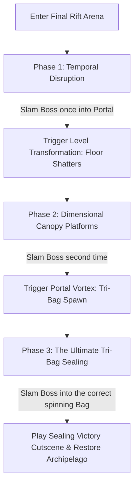

# Real Evil Pig Boss AI & Combat Mechanics Specification
## Project: The Legacy of Tomba & the Evil Pigs' Curse

---

## 1. Introduction to Multi-Phase Boss Fights (The Climax Concept)

The final confrontation of the First Era against the **Real Evil Pig (The Supreme Sovereign)** represents the absolute peak of the game's difficulty and mechanical complexity.
* **Why Multi-Phase?**: If a final boss behaved exactly the same way from the start of the fight to the end, the battle would quickly feel repetitive. 
* **The Design**: To create an epic, memorable climax, the battle is divided into **Three Phases**. As the boss takes damage or is thrown, the environment physically deforms, the boss unlocks more aggressive spells, and the player is forced to dynamically combine all the skills they have learned throughout the game (jumping, grabbing, swinging, and plane-shifting).

---

## 2. Boss Battle Phase Transition Engine

The boss's state machine tracks active vulnerability states and triggers environmental transitions when the boss is successfully grabbed and slammed.



---

## 3. Phase-by-Phase Technical Specifications

### 3.1 Phase 1: Temporal Disruption (The Frozen Clock)
* **Aesthetic**: The arena is a grand, decaying clocktower hall floating in a starry void.
* **Boss Behavior**: The Real Evil Pig hovers on sorting plane $0.0$, but periodically teleports to the background plane $+10.0$.
* **Primary Spell: Temporal Freeze**: The boss launches a slow-moving, glowing blue temporal spark (`PROJ_TIME_SPARK`).
  * *Collision Effect*: If it hits the Savior, all player movement inputs are completely frozen for $1.5 \, \text{seconds}$.
  * *Player Counter*: The player must wiggle the controller's analog stick back and forth rapidly to break the ice shield before the boss follows up with a heavy overhead staff strike.

### 3.2 Phase 2: Dimensional Canopy Platforms (The Shattered Arena)
* **Transition Trigger**: Executed when the Savior successfully grabs the boss and throws him into the active center rift. The clocktower floor shatters, collapsing into small, floating stone platforms suspended over a cosmic storm.
* **Gameplay Change**: The Savior can no longer walk freely. He must use the **Grapple Hook** to swing between platforms and hang from vertical metal chains to stay above the death-zone void.
* **Boss Attack: Fire Rain**: The boss teleports to the center, channeling a spell that drops molten meteors across random platform coordinates. The player must calculate their swinging trajectory to avoid the falling hazards.

### 3.3 Phase 3: The Ultimate Sealing (The Tri-Bag Vortex)
* **The Climax**: The boss enters a defensive, levitating state. To seal him permanently, the player must grab him one final time.
* **The Sealing Obstacle**: Three different Magic Pig Bags (Red, Blue, Navy) appear floating in the air, spinning rapidly in a $3\text{D}$ circular orbital path around the arena center.
* **The Throw Requirement**: The player must aim and launch the boss. The throw vector must align *exactly* with the **Blue Pig Bag** when it crosses the forward projection plane. Throwing the boss into the wrong bag causes him to bounce off, triggering an explosive shockwave that inflicts $2$ bars of damage to the Savior.

```mermaid
graph TD
    subgraph Tri-Bag Orbit System (Phase 3 Geometry)
        A[Bag 1: Red Pig Pouch] <-->|Rotates at 90°/sec| B[Bag 2: Navy Pig Pouch]
        B <-->|Rotates at 90°/sec| C[Bag 3: Blue Pig Pouch - Target]
        C <-->|Rotates at 90°/sec| A
        D[Savior Grab Position] -->|Aim Angle Vector| E{Throw Release Point}
        E -->|Aligns with Blue Bag| F[SUCCESSFUL SEALING]
        E -->|Aligns with Red/Navy Bag| G[BOUNCE RECOIL / Damage applied to Savior]
    end
```

---

## 4. Boss Attack & Damage Matrix

The balancing values of the Real Evil Pig's visual and physical hitboxes are tuned as follows:

| Attack Name | Projectile Sprite / ID | Hitbox Radius | Direct Damage | Speed / Rate of Trigger |
| :--- | :--- | :--- | :--- | :--- |
| **Temporal Spark** | `PROJ_TIME_SPARK` | $0.8 \, \text{meters}$ | $0$ (Inflicts freeze) | Single shot, fires every $8.0 \, \text{seconds}$. |
| **Sovereign Jab** | `WEAPON_PIG_STAFF` | $1.5 \, \text{meters}$ | $2$ Vitality Bars | Instant swipe ($0.15 \, \text{s}$ warning frames). |
| **Volcanic Cinder** | `PROJ_METEOR_SHARD` | $1.2 \, \text{meters}$ | $1$ Vitality Bar | Falling rain trajectory, $3.0 \, \text{m/s}$ descent. |
| **Rift Shockwave** | `FX_RIFT_WAVE` | Screen-wide vertical | $1$ Vitality Bar | Triggered on incorrect bag throws. Jump to evade. |