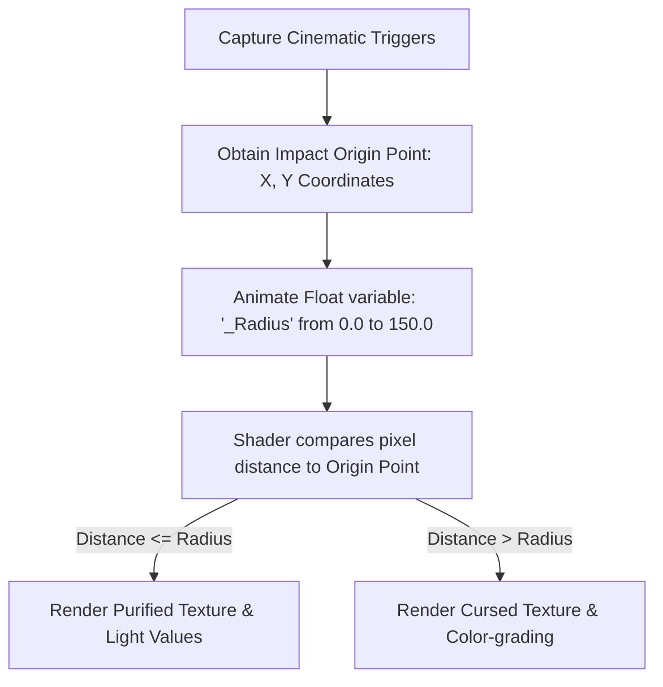
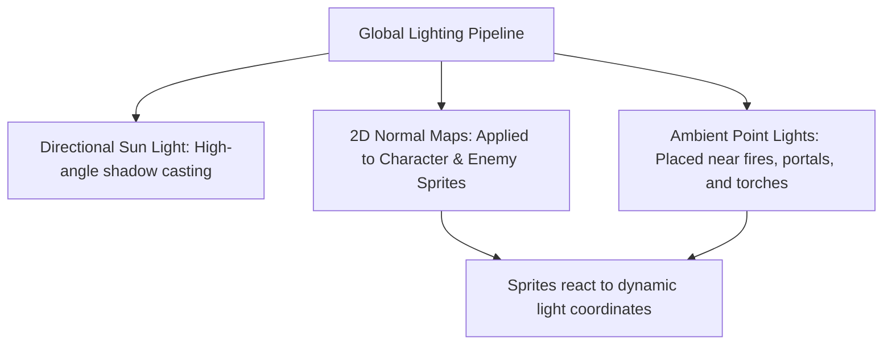

# Rendering, Lighting & Purifying Shaders Specification
## Project: The Legacy of Tomba & the Evil Pigs' Curse

---

## 1. Real-Time Environmental Purification Effect

When an Evil Pig is sealed inside its corresponding Pig Bag, the region undergoes an immediate, dynamic visual transformation. The environment does not simply cut to a black screen or perform a basic dissolve fade. Instead, an organic, radial shockwave sweeps across the landscape, transforming the textures and lighting in real time.

---

## 2. The Radial Transition Shader Logic

The environmental conversion is managed by a custom screen-space post-processing shader. The shader interpolates between two render buffers (Cursed Buffer and Purified Buffer) based on an expanding radial mask.

### 2.1 Mathematical Shader Operations
For each pixel coordinate ($P$), the shader calculates its distance ($D$) from the capture collision origin coordinate ($O$):

$$D = \sqrt{(P_x - O_x)^2 + (P_y - O_y)^2}$$

The transition factor ($T$) is defined by evaluating the distance against the active expanding radius ($R$) and a softness value ($S$):

$$T = \text{Clamp}\left(\frac{R - D}{S}, 0, 1\right)$$

* When $T = 0.0$: The pixel renders the cursed texture set with cold, dark color channels.
* When $T = 1.0$: The pixel renders the fully restored, warm, and highly saturated purified texture set.
* **Organic Noise Modification**: To prevent a perfect circle from looking too artificial, a 2D Perlin Noise texture map is subtracted from the radius value $R$, creating an organic, vine-like wave pattern during expansion.

---

## 3. Lighting & Volumetric Environments in 2.5D Space

The 2.5D world blends flat 2D sprites with full 3D physical geometry, requiring a carefully constructed lighting setup to preserve the artistic cartoon feel while retaining structural depth.

### 3.1 Sprite lit Shaders & Normal Mapping
All character and enemy sprites utilize a custom Lit Shader. This shader uses normal map textures (defining physical depth slopes of the drawn lines) to calculate dynamic diffuse lighting reflections:
* **Result**: When the Savior stands near a burning volcanic geyser or holds a torch inside a cave, his sprite displays realistic, soft highlight projections on the side facing the light source, blending him naturally into the 3D rendered scenery.

---

## 4. Post-Processing Stack Layering

Each region runs a dedicated **Post-Processing Volume** component that overrides color profiles depending on the active purification state.

| Profile Name | Color Temperature | Contrast Scale | Bloom Intensity | Vignette Strength |
| :--- | :--- | :--- | :--- | :--- |
| **Cursed Forest** | Cold ($-40$) | High ($+25$) | $3.5$ (Unstable violet glow) | $0.45$ (Choking dark borders) |
| **Purified Forest**| Warm ($+15$) | Balanced ($0$) | $1.2$ (Natural golden sunlight) | $0.15$ (Open and bright view) |