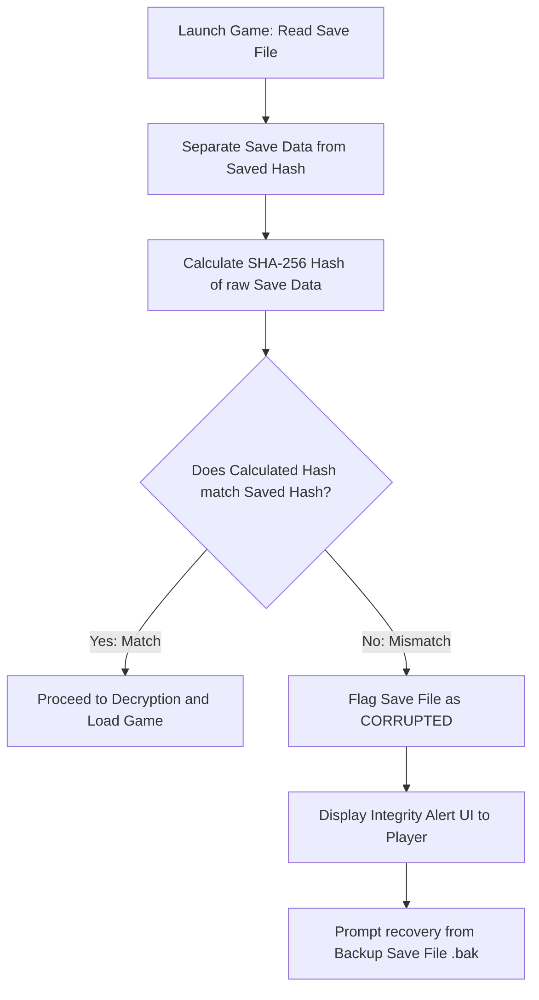

# Save File Integrity & Anti-Cheat Specification
## Project: The Legacy of Tomba & the Evil Pigs' Curse

---

## 1. Introduction to Save File Tampering (The Problem)

In progressive action-adventure games, the player’s achievements are tied to their progression variables (such as Adventure Points (AP) balance, unlocked weapons, and completed events).
* **The Exploit**: Because save files are stored locally on the player's computer hard drive, they are vulnerable to tampering. A player could open a standard, unencrypted save file using a plain text editor (like Notepad) and change their AP balance from $500$ to $9,999,999$, instantly unlocking all AP chests and skipping hours of designed challenges.
* **The Solution**: The game implements a two-stage security protocol: **XOR Obfuscation** (scrambling the text to make it unreadable) and **SHA-256 Checksum Validation** (generating a unique digital fingerprint of the file to detect any unauthorized modifications).

---

## 2. Cryptographic Checksum Validation Cycle

A **Checksum** (or Hash) is a unique mathematical string of characters generated by running a file's data through an algorithm. If even a single character or number inside the save file is altered by the player, the resulting checksum changes completely, alerting the engine to the modification.



---

## 3. XOR Obfuscation Pipeline (Data Scrambling)

To prevent players from viewing the raw JSON text of their save files, the engine applies an **XOR Obfuscation Pass** during the disk-write phase. This scrambles the text bytes using a secret, hardcoded multi-byte key.

```mermaid
graph LR
    subgraph Save Encryption (Disk Write)
        A[Raw JSON Text] --> B[XOR Bitwise Operation with Secret Key]
        B --> C[Scrambled Binary Stream]
        C --> D[Write Binary to Disk .sav]
    end
    subgraph Save Decryption (Disk Read)
        E[Read Binary from Disk .sav] --> F[XOR Bitwise Operation with Secret Key]
        F --> G[Reconstructed JSON Text]
        G --> H[Parse Save Data into Game RAM]
    end
```

### 3.1 XOR Technical Mechanics
The bitwise exclusive OR (XOR) operation is highly efficient, running at minimal CPU cost. Running the operation twice with the same key perfectly reconstructs the original text:

$$\text{Data} \oplus \text{Key} = \text{ScrambledData}$$
$$\text{ScrambledData} \oplus \text{Key} = \text{Data}$$

The secret encryption key is stored compiled inside the game's executable assembly to prevent casual extraction by players.

---

## 4. Integrity Alert UI Design

If the validation check fails (signaling a hacked or corrupted file), the engine suspends the loading process and triggers a dedicated system dialog:

* **Header Title**: *"SAVE FILE INTEGRITY ERROR"*
* **Body Text**: *"The save file in Slot [N] appears to have been modified or corrupted. To protect the game's progression balance, this file cannot be loaded."*
* **Interactive Option**: *"Restore Backup"* — Copies the contents of the automated, uncorrupted backup file (`save_slot_N.bak`) over the active save slot, allowing the player to safely recover their legitimate progress.