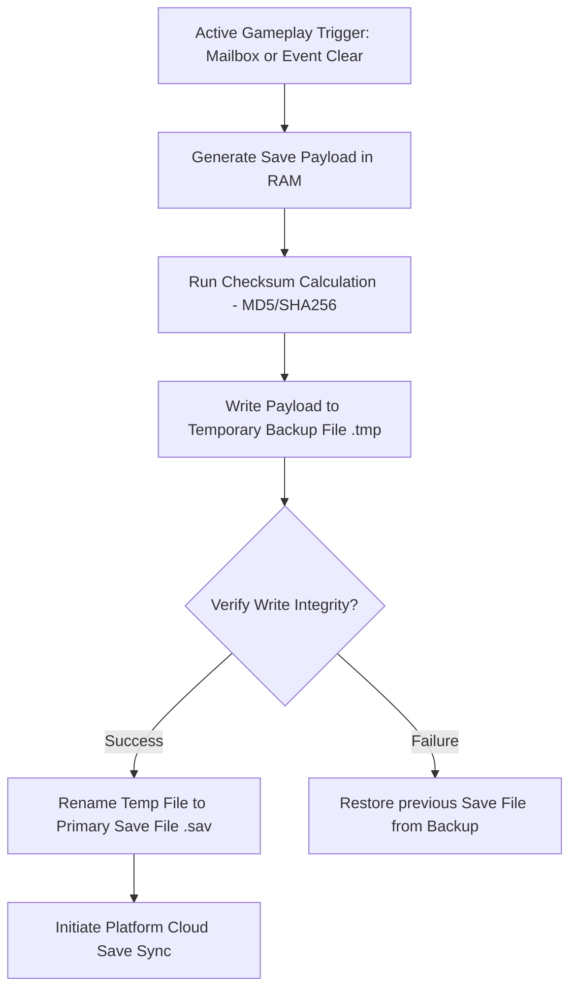
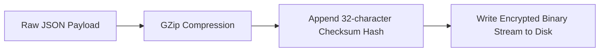

# Save Systems & Serialization Specification
## Project: The Legacy of Tomba & the Evil Pigs' Curse

---

## 1. Save File Architecture & Security

The save game system ensures that the player's detailed progression across the non-linear archipelago is stored efficiently, securely, and with zero latency impact during gameplay.



### 1.1 Save Trigger Mechanisms
* **Manual Saves (Mailboxes)**: Interacting with postal mailboxes scattered across the safe hubs prompts the player to write to one of three manual save slots.
* **Auto-Saves (Auto-checkpoints)**: The engine automatically records a quicksave state on a dedicated, rotating system slot upon:
  * Entering a new regional screen transition.
  * Clearing any major or minor Event.
  * Capturing an Evil Pig.

---

## 2. Serialization Data Schema (JSON)

To maintain platform compatibility (PC, console, mobile), the game serializes the active session state into a structured JSON string. Below is the blueprint of a production save file.

```json
{
  "save_file_version": "1.0.0",
  "timestamp": 1718293821,
  "playtime_seconds": 14205,
  "active_era": 1,
  "last_spawn_point": {
    "zone_id": "Dwarf_Forest",
    "spawn_node_id": "SP_DWARF_VILLAGE_02",
    "coordinates": { "x": 1204.5, "y": 32.2, "z_plane": 1 }
  },
  "player_attributes": {
    "current_vitality_bars": 8,
    "max_vitality_bars": 12,
    "adventure_points_balance": 125400,
    "lifetime_accumulated_ap": 250000
  },
  "inventory": {
    "active_weapon_id": "WP_FLAIL_STANDARD",
    "unlocked_weapons": ["WP_PUNCH", "WP_BOOMERANG_WOOD", "WP_FLAIL_STANDARD"],
    "active_pants_id": "PT_GREEN_FOREST",
    "unlocked_pants": ["PT_WILD_DEFAULT", "PT_GREEN_FOREST"],
    "collected_items": [
      { "item_id": "IT_DF_ELDER_KEY", "quantity": 1 },
      { "item_id": "IT_SACRED_PEACH", "quantity": 3 }
    ],
    "collected_pig_bags": ["IT_PIG_BAG_BLUE"]
  },
  "world_state": {
    "purified_zones": ["Dwarf_Forest_Zone"],
    "event_boolean_flags": {
      "is_dwarf_gate_open": true,
      "is_haunted_elevator_active": false
    }
  },
  "event_log_states": {
    "completed_events": ["EV_BEG_001", "EV_DF_001", "EV_DF_004"],
    "active_events": [
      { "event_id": "EV_DF_012", "objectives_count_cleared": [1] }
    ]
  }
}
```

---

## 3. Storage Optimization & Integrity Verification

To prevent file tampering (cheating) and raw write errors, the system wraps the serialized JSON payload before saving it to the target platform’s local storage directory.



### 3.1 Serialization Methods
* **Binary Compression**: The raw JSON string is compressed using GZip to reduce the save file footprint below $50 \, \text{KB}$, which optimizes upload times for cloud save systems (PlayStation Network Cloud, Steam Cloud).
* **Integrity Validation**: When loading a save file, the engine calculates the hash of the data stream and compares it with the appended checksum hash. If the values do not match, the file is flagged as **Corrupt**. The engine then prompts the user to restore the game using the backup save file (`.bak`).