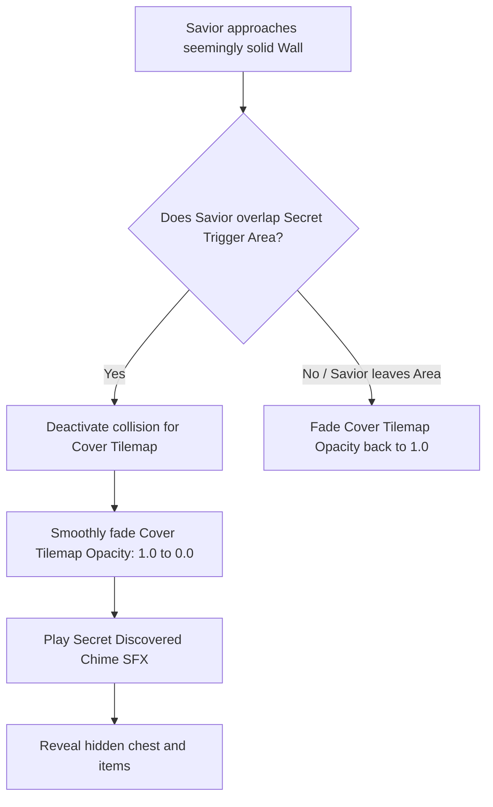
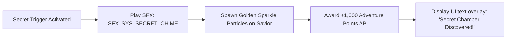

# Secret Passages & Backtracking Gating Specification
## Project: The Legacy of Tomba & the Evil Pigs' Curse

---

## 1. Introduction to Backtracking & Gating (The Metroidvania Loop)

In standard linear platformers, when a player clears a level, they move forward and never look back. 
* **The Metroidvania Loop**: Our game world is a single, massive, interconnected network of paths. Early in exploration, the Savior will find locked gates, deep lakes, or high cliffs that he cannot cross. 
* **The Backtracking Mechanic**: The player must note these blocked paths, continue exploring elsewhere to find new upgrade relics (such as *Abyssal Diving* or the *Flying Squirrel Suit*), and then return (**Backtrack**) to these initial rooms to open those locked paths. This rewards memory, curiosity, and spatial orientation.

---

## 2. Illusory Walls & Hidden Room Fading

A classic way to hide secrets is using **Illusory Walls**—terrain blocks that look solid but allow the Savior to walk right through them into a hidden treasure chamber.

### 2.1 The Fading Algorithm (Lerping Alpha)
When the Savior triggers the hidden room entrance, the engine does not instantly make the cover wall disappear. It smoothly reduces the transparency (**Alpha channel**) of the cover material over $0.4 \, \text{seconds}$ using Linear Interpolation (Lerp):

$$\text{ActiveAlpha} = \text{Lerp}(1.0, 0.0, \text{ElapsedTime} / 0.4)$$

This visual fade gives the player a satisfying sensation of peering behind a curtain, revealing the hidden chamber layout cleanly.

---

## 3. Backtracking Gating Specifications

The world design implements several physical gating barriers, mapped to specific required abilities or items.

| Gating Barrier Type | Visual Presentation | Required Unlock Relic | Mechanics of Resolution |
| :--- | :--- | :--- | :--- |
| **Volcanic Vent** | High-temperature steam geysers blocking vertical pathways. | **Red Fire Pants** | Wearing the Red Fire Pants grants full heat mitigation, allowing the Savior to walk through the geyser unscathed. |
| **Deep Lake** | Acidic or deep water bodies with submerged entrance tunnels. | **Abyssal Diving** | The Savior gains underwater movement controllers, allowing him to dive and pull levers at the lake bottom. |
| **Abyssal Ravine** | Extremely wide horizontal gaps that standard jumps cannot cross. | **Flying Squirrel Suit** | The player glides across the wind currents rising from the ravine, reaching the far ledge. |
| **Dwarf Gate** | Locked wooden stone door with an empty runic socket. | **IT_DF_ELDER_KEY** | Obtained after resolving event `EV_DF_001`. Key is inserted to trigger gate opening. |

---

## 4. Secret Discovery Reward Feedback

Finding a secret room must trigger high positive reinforcement.

This instant loop of audio, visual sparkles, and numerical points ensures players feel highly accomplished whenever they take the time to test suspicious walls or return to previously inaccessible areas.