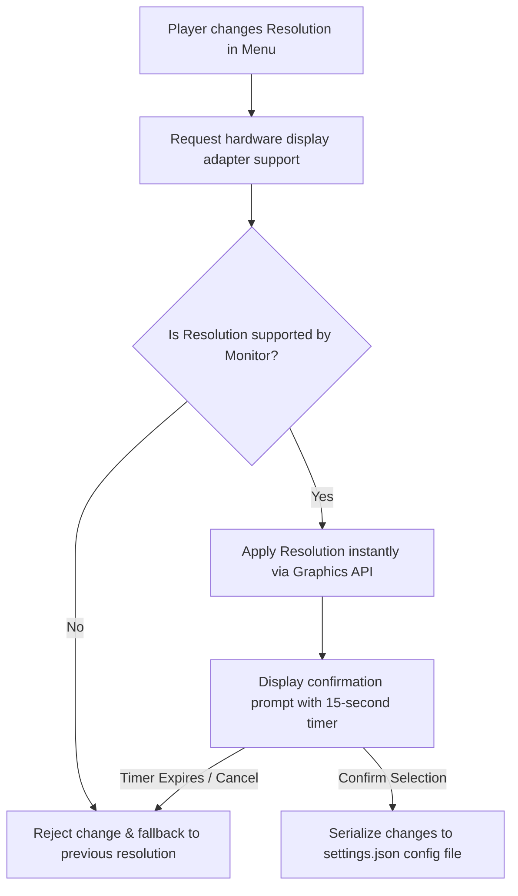
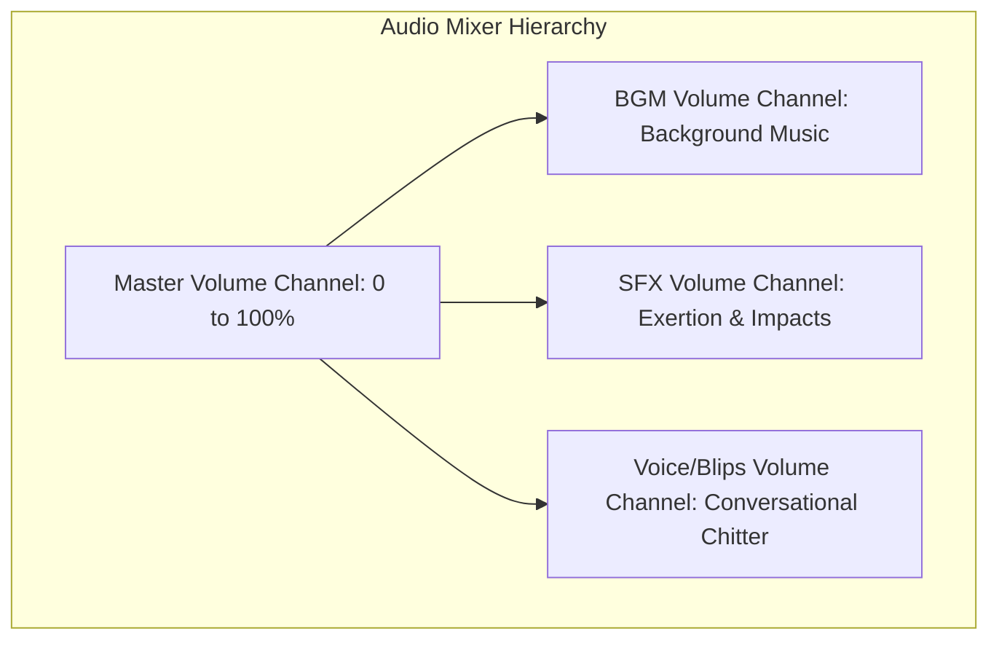

# Settings, Video & Audio Configuration Specification
## Project: The Legacy of Tomba & the Evil Pigs' Curse

---

## 1. Introduction to Settings Panels (The Settings Concept)

A **Settings / Options Panel** is the control hub that allows players to customize how the game software runs on their specific physical computer or console hardware.
* **Why it matters**: Every player has different hardware. One player might have a high-end gaming PC with a fast monitor, while another might play on a low-end laptop or a portable console. 
* **The Goal**: The settings panel allows the player to adjust graphical detail, monitor resolution, and audio volume levels. This ensures the game runs smoothly (maintaining a high, stable frame rate) and remains comfortable to play under any environment.

---

## 2. Settings Application Flow

When a player changes a setting (such as screen resolution), the engine must verify hardware compatibility before writing the changes permanently to disk.



---

## 3. Video & Graphical Settings Specs

These parameters hook directly into the active graphics rendering API (DirectX 12, Vulkan, or Metal) to control GPU performance.

| Option Name | Target Options | Hardware System Affected | Description for Newcomers |
| :--- | :--- | :--- | :--- |
| **Screen Resolution**| $1280 \times 720$ up to $3840 \times 2160$ | Display Output Buffer | Controls the density of pixels on screen. Higher values look crisper but require significantly more GPU power. |
| **Display Mode** | Fullscreen / Borderless / Windowed | OS Window Manager | Fullscreen yields the best performance. Windowed allows fast multi-tasking on PCs. |
| **Vertical Sync (V-Sync)**| On / Off | Frame Buffer Synchronization | Syncs the game's frame rate with the monitor's physical refresh rate to prevent **Screen Tearing** (visual horizontal split lines). |
| **Max Frame Rate** | $30 \, \text{fps} / 60 \, \text{fps} / 120 \, \text{fps} / \text{Unlimited}$| Engine Main Loop Timer | Limits how many frames the GPU renders per second. Capping at $60$ prevents laptop battery drain and overheating. |
| **Texture Quality** | High / Medium / Low | VRAM Allocation (GPU Memory) | Controls the resolution of sprites. Low textures decrease VRAM footprint, preventing game crashes on older machines. |

---

## 4. Audio Mixer Channels

Audio levels are not increased linearly. They are managed through a logarithmic decibel scale inside the Global Mixer to align with how human ears perceive volume changes.



* **Calculation Formula**:
  The user interface slider returns a linear value from $0.0$ (Muted) to $1.0$ ($100\%$ Volume). The audio engine translates this value to decibels ($dB$) using the following formula:

$$\text{Decibels} = 20 \times \log_{10}(\text{SliderValue})$$

* This logarithmic conversion ensures that moving the volume slider from $100\%$ down to $50\%$ feels like a natural halving of the volume, rather than a sudden drop to near-silent levels.

---

## 5. Settings Serialization (Save Preferences File)

When settings are confirmed, they are written to a lightweight JSON file (`settings.json`) located in the application's local system preferences folder:

```json
{
  "settings_version": "1.0.0",
  "video": {
    "resolution_width": 1920,
    "resolution_height": 1080,
    "display_mode": "Borderless",
    "vsync": true,
    "max_fps_cap": 60,
    "texture_quality": "High"
  },
  "audio": {
    "master_volume": 0.80,
    "bgm_volume": 0.70,
    "sfx_volume": 0.90,
    "voice_blip_volume": 0.85
  }
}
```