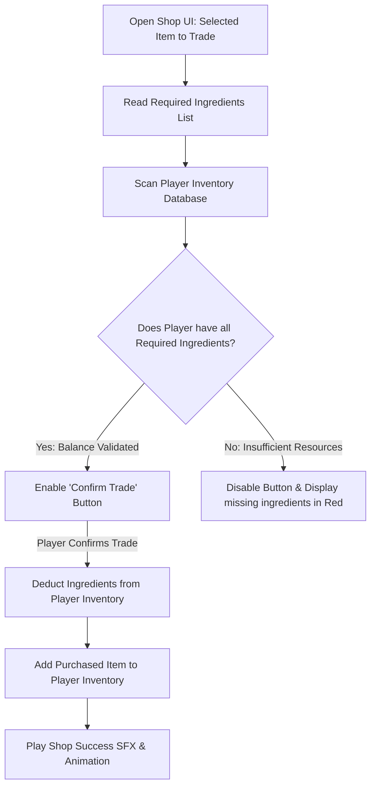

# Shop Economics & Barter System Specification
## Project: The Legacy of Tomba & the Evil Pigs' Curse

---

## 1. Introduction to Barter Economics (The Trading Concept)

In traditional role-playing video games, players collect gold coins from defeated monsters and spend them at shops. 
* **The Lore Twist**: In our game world, the gold is highly cursed by the Evil Pigs' alchemy. The native inhabitants (Dwarves, Jungle Tribes) refuse to touch gold, as they know it acts as a catalyst for misfortune.
* **The Solution**: The archipelago operates entirely on a **Barter & Trade System**. To acquire upgrades (such as specialized *Power Pants* or tools), the Savior must trade natural resources (such as sacred fruits, rare wood, or monster trophies) that he gathers during exploration.

---

## 2. Barter Transaction Verification Loop

When the Savior interacts with a Merchant NPC, the engine suspends active physics, opens the Shop UI, and runs a balance check on the player's inventory before allowing any exchange.



---

## 3. Master Barter Database (Standard Trades)

Merchants specialize in different biomes, trading local survival gear for regional resources.

| Merchant ID | Item Offered | Required Barter Ingredients (Cost) | Gameplay Impact of Upgraded Item |
| :--- | :--- | :--- | :--- |
| **`MER_DWARF_SHOP`** | **`IT_HERB_ANTIDOTE`** | $3 \times$ `IT_FRUIT_BLUEBERRY` | Cleanses the *Weeping* or *Laughing* emotional mushroom status instantly. |
| **`MER_DWARF_SHOP`** | **`PT_GREEN_FOREST`** | $1 \times$ `IT_DF_DWARF_MEDAL` AND $5 \times$ `IT_GOLDEN_PEACH` | Upgraded pants. Increases run speed by $15\%$ and jump heights by $10\%$. |
| **`MER_TRIBAL_BARTER`**| **`WP_BOOMERANG_METAL`**| $1 \times$ `WP_BOOMERANG_WOOD` AND $2 \times$ `IT_IRON_ORE` | Weapon upgrade. Increases projectile range to $9.0 \, \text{meters}$ and can break ice. |
| **`MER_TRIBAL_BARTER`**| **`MASK_TRIBAL_TRUE`** | $10 \times$ `IT_PIG_MINION_MUD_EYE` | Key quest item. Allows the Savior to talk peacefully to the Jungle Tribe Chief. |

---

## 4. Trading UI Grid Layout & Verification Logic

The Barter UI is designed to be highly legible. It is split into two balanced halves: the Merchant’s Inventory (Left Side) and the Transaction Cart (Right Side).

```
  +-------------------------------------------------------------+
  |                        BARTER TRADING                       |
  +-------------------------------------------------------------+
  |  MERCHANT SHELVES [Select]  |  TRANSACTION CART [Confirm]   |
  |  +-----------------------+  |  ITEM: Green Forest Pants     |
  |  | [PT_GREEN_FOREST]     |  |  ---------------------------  |
  |  | [IT_HERB_ANTIDOTE]    |  |  REQUIRED INGREDIENTS:        |
  |  |                       |  |  * [X] Dwarf Medal (1 / 1)    |
  |  +-----------------------+  |  * [ ] Golden Peach (3 / 5)   |
  +-------------------------------------------------------------+
  |  [STATUS]: INSUFFICIENT MATERIALS - Gather 2 more Peaches!  |
  +-------------------------------------------------------------+
```

* **Interactive Elements**:
  * **Dynamic Ingredient Slots**: The ingredients listed on the right side display dynamic checkboxes. If the player possesses the required amount, a green checkmark (`[X]`) is rendered. If they do not, a red warning indicator displays the deficit (e.g., `(3 / 5)`).
  * **Transaction Sound Effects**: Confirming a successful trade triggers a cash-register-style chime (`SFX_UI_BARTER_SUCCESS`). Attempting to trade with insufficient ingredients triggers a low-frequency buzzer sound (`SFX_UI_BARTER_FAIL`).