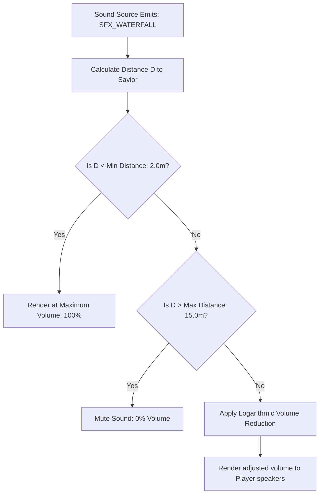
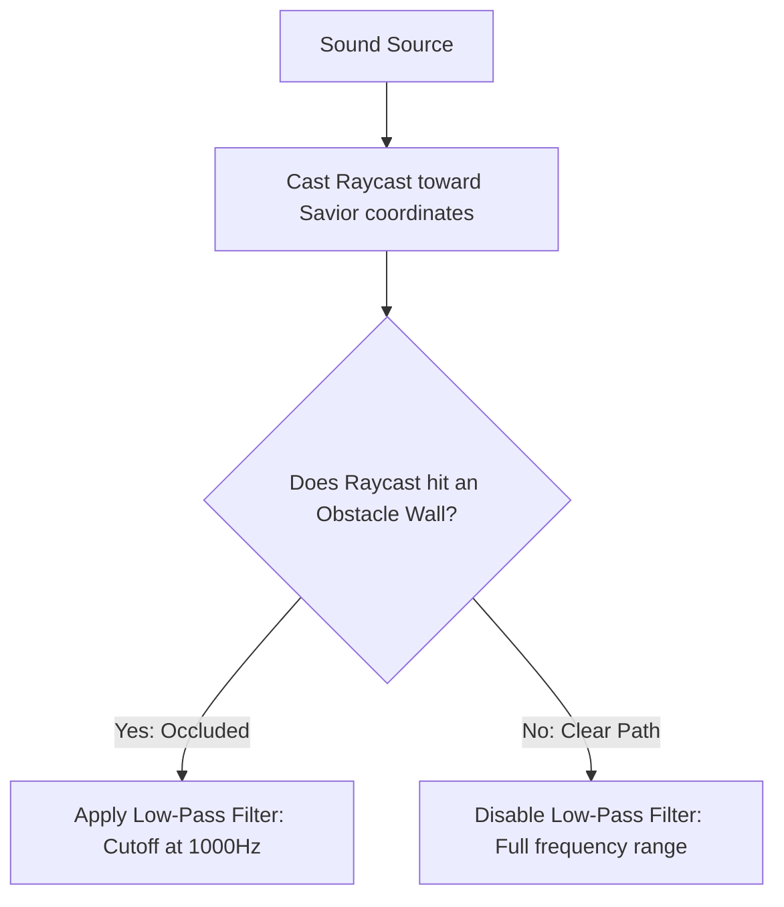
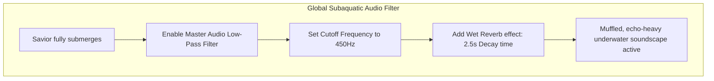

# Spatial Audio & Acoustic Propagation Specification
## Project: The Legacy of Tomba & the Evil Pigs' Curse

---

## 1. Introduction to Spatial Audio (The Volumetric Sound Concept)

In early flat 2D video games, when an enemy made a sound (like a growl), the player heard it at the exact same volume regardless of where the enemy was located on the screen.
* **The Concept**: To make our 2.5D world feel deep and alive, the game engine uses **Spatial Audio**. If a waterfall is far off in the background layer, it sounds like a quiet, muffled rumble. As the Savior walks closer to it on the X and Z axes, the sound dynamically shifts to become louder and wider.
* **Why it matters**: Spatial audio acts as a critical gameplay guide. It allows players to navigate blind areas using their ears, detecting hidden enemies, moving traps, or secret rushing streams through auditory cues.

---

## 2. Logarithmic Distance Attenuation (Sound Falloff)

As sound waves travel through air, their energy (volume) decreases. The game engine simulates this using a **Logarithmic Attenuation Curve**.

### 2.1 The Attenuation Equation
The dynamic volume ($V$) of a spatial sound source relative to its distance ($D$) from the Savior is calculated as:

$$V = \text{Clamp}\left(\frac{\text{MinDistance}}{D + (\text{DecayRate} \times (D - \text{MinDistance}))}, 0.0, 1.0\right)$$

* **Minimum Distance ($2.0 \, \text{meters}$)**: The range within which the sound is heard at full intensity ($100\%$).
* **Maximum Distance ($15.0 \, \text{meters}$)**: The boundary beyond which the sound completely fades out ($0\%$). This prevents distant background sounds from cluttering the audio memory buffer.

---

## 3. Acoustic Occlusion (Muffling Behind Walls)

If an enemy or environmental hazard lies behind a thick stone wall, the sound waves cannot travel freely. The engine simulates this using **Acoustic Occlusion**.

* **The Low-Pass Filter (LPF)**: An LPF acts like an acoustic sponge, letting low-frequency rumble pass through while blocking high-frequency snaps. 
* When occluded, high-pitched frequencies above $1000 \, \text{Hz}$ are stripped, leaving a muffled bass rumble that intuitively informs the player that the sound source is physically blocked by terrain.

---

## 4. Subaquatic Low-Pass Filtering (Underwater Occlusion)

When the Savior dives fully underwater inside the *Water Temple*, the global audio mix of the entire game shifts dynamically to recreate the acoustics of liquid immersion.

This master filter muffles all environmental music and standard sound effects, while boosting sub-aquatic bubbles and swimming paddle sounds. It instantly places the player into a highly immersive underwater space.