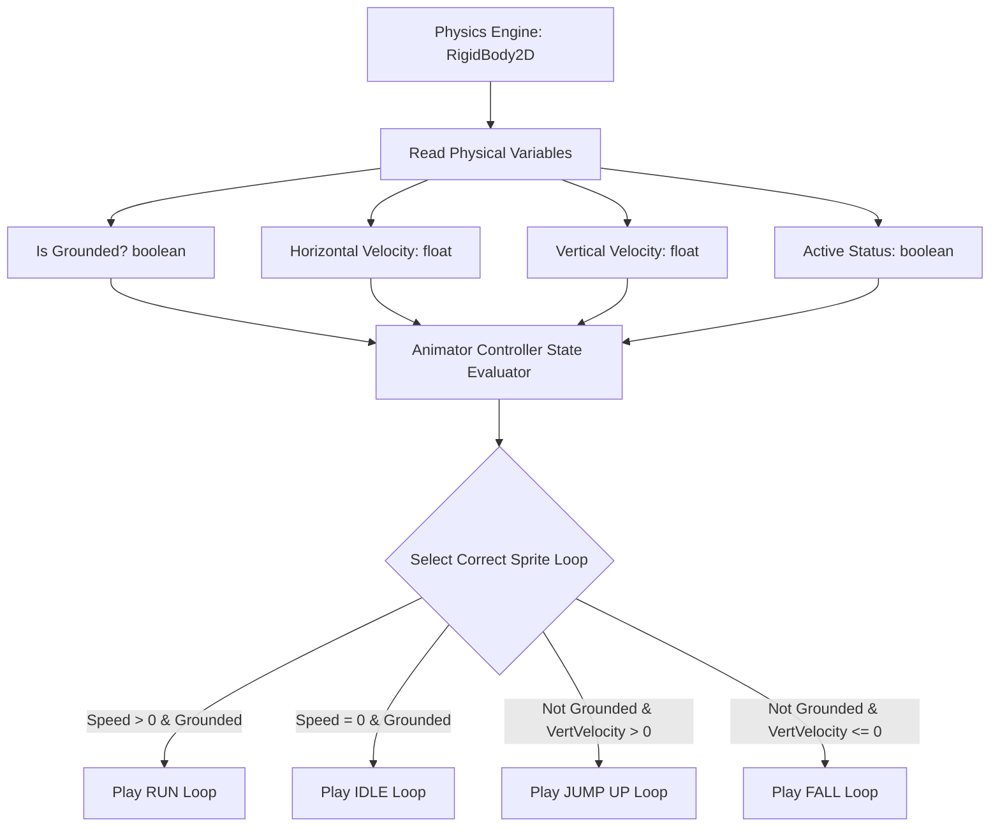
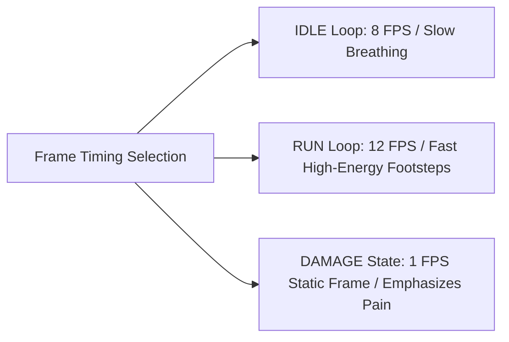

# Sprite Animation State Transitions Specification
## Project: The Legacy of Tomba & the Evil Pigs' Curse

---

## 1. Introduction to Sprite Animation (How Characters Move)

In a 2D game, characters do not move by themselves. They are created by compiling a sequence of static drawings, called **Sprites**, arranged inside a large grid layout sheet (a **Sprite Sheet**). 
* **The Concept**: By playing these drawings one after another at a specific speed (e.g., $12$ frames per second), we create the illusion of fluid life, similar to a traditional cartoon or anime.
* **The Controller**: To ensure the character plays the correct animation at the correct time, the engine uses an **Animator State Machine**. This software checks what the physics engine is doing (e.g., running, jumping, swimming, or getting damaged) and instantly swaps the active sequence of drawings to match the physical state.

---

## 2. Physics-to-Animation Synchronization (The Parameters)

The Animator controller monitors specific physical variables parsed from the Savior's central `RigidBody2D` component to determine transition triggers.

---

## 3. Sprite Transition & Logic Matrix

Transition rules define the logical paths between animations, preventing sudden visual pops or cut-offs.

| Source State | Destination State | Trigger Conditions (Parameters Evaluated) | Fade / Blend Duration |
| :--- | :--- | :--- | :--- |
| **`AN_IDLE`** | **`AN_RUN`** | `horizontal_speed > 0.1` AND `is_grounded == True` | Instant ($0 \, \text{seconds}$ transition) |
| **`AN_RUN`** | **`AN_IDLE`** | `horizontal_speed <= 0.1` AND `is_grounded == True` | $0.05 \, \text{seconds}$ |
| **`AN_RUN`** | **`AN_JUMP_UP`** | `is_grounded == False` AND `vertical_velocity > 0.5` | Instant |
| **`AN_JUMP_UP`** | **`AN_FALL`** | `vertical_velocity <= 0.0` | $0.10 \, \text{seconds}$ |
| **`AN_FALL`** | **`AN_LAND`** | `is_grounded == True` | Instant |
| **`AN_LAND`** | **`AN_IDLE`** | On Animation Completed / Wait for recovery frame | Automated on loop end |

---

## 4. Frame Rates & Hand-Drawn Retro Animation Speeds

To replicate the visual charm of classic 90s console games and Japanese cel animation, animation loops must operate at custom speeds. Standardizing the frames prevents the game from looking too digital or mechanically smooth.

### 4.1 Animation Frame Budget Specifications
* **Idle Animation Loop**: $8$ unique drawings played over a loop. Each frame remains on screen for $125 \, \text{milliseconds}$.
* **Running Animation Loop**: $12$ unique drawings played in sequence. Each frame remains on screen for $83 \, \text{milliseconds}$ to match the fast stride of the Savior’s legs.
* **Sprite Pivot Points**: To prevent the character from sliding or shifting coordinates when swapping animations, all sprites inside the sprite sheets must share a locked, identical central pixel coordinate origin (the **Pivot Point**, set to the bottom-center coordinate: $X: 0.5, Y: 0.0$).