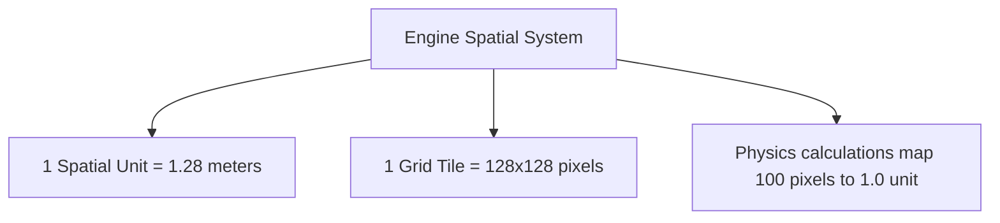
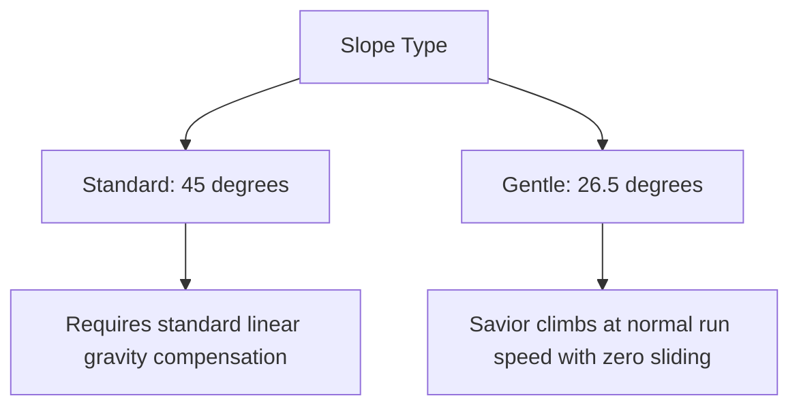
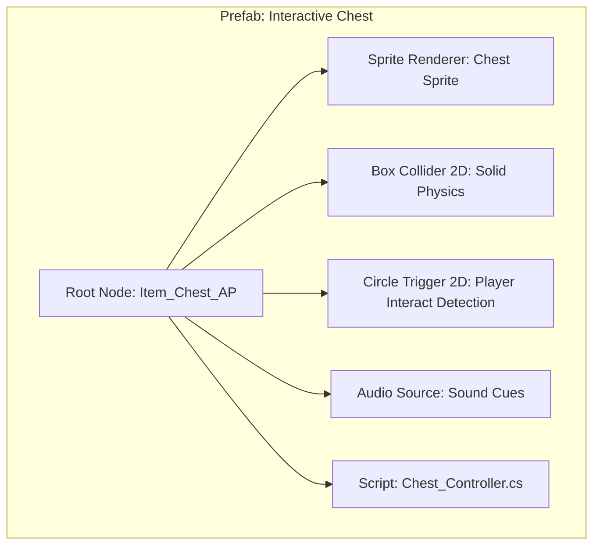

# Tileset Construction & Level Prefabs Guide
## Project: The Legacy of Tomba & the Evil Pigs' Curse

---

## 1. Grid Sizing & Unit Scale

To ensure pixel-perfect alignment and consistent physics scaling across all levels, the game operates on a strict grid-based spatial system.



### 1.1 Sorting Layer Architecture
To prevent visual rendering conflicts between overlapping 2D layers, assets are categorized into strict sorting planes:

| Sorting Layer | Z-Depth Offset | Asset Allocation |
| :--- | :--- | :--- |
| **Layer -4 (Far BG)** | $+50.0$ | Distant skyboxes, sunbeams, clouds, silhouette mountains. |
| **Layer -3 (Mid BG)** | $+25.0$ | Distant forest trees, village background silhouettes. |
| **Layer -2 (Play BG)** | $+10.0$ | Inactive gameplay elements, background fences, ladders. |
| **Layer -1 (Detail)** | $+1.0$ | Grass patches, rocks, foreground hanging vines, decals. |
| **Layer 0 (Active)** | $0.0$ | Savior, enemies, active terrain blocks, item chests. |
| **Layer 1 (FG Detail)**| $-5.0$ | Large foreground tree trunks, screen-border leaves, HUD. |

---

## 2. Auto-Tiling Logic (Rule Tiles)

To speed up level design, environmental tilesets utilize a **Rule Tile System**. This automated script detects adjacent tile colliders in 8 directions and swaps the sprite to match the correct border geometry.

```mermaid
grid-layout
    {"title": "8-Point Rule Matrix", "cols": 3, "rows": 3}
    ["Top-Left check", "Top check", "Top-Right check"]
    ["Left check", "Center Tile (Target)", "Right check"]
    ["Bottom-Left check", "Bottom check", "Bottom-Right check"]
```

### 2.1 Rule Configuration Guidelines
* **Inner Tiles**: Sprite is a solid, dark soil pattern with no outer borders.
* **Top Borders**: Sprite features lush grass blades and organic stone borders.
* **Corners**: Smooth, rounded corner curves ($16 \, \text{px}$ radius corner chamfer) to prevent the platforms from looking unnaturally sharp and digital.

---

## 3. Slope Physics & Collider Setup

Unlike rigid, blocky platformers, the Savior climbs slopes smoothly. Levels utilize **Edge Colliders** rather than square tile colliders for dynamic terrain.



* **Physical Execution**: The Savior's physics controller measures the ground slope angle ($\theta$) using downward raycast checks. If $\theta \le 45^\circ$, the system applies a parallel force vector to prevent the Savior from sliding backward, maintaining a fluid movement arc.

---

## 4. Standardized Level Design Prefabs

To keep level files light and modular, designers construct levels by placing pre-configured templates known as **Prefabs**.



### 4.1 Core Level Building Blocks

* **`PRE_GATE_Z_AXIS`**:
  * *Components*: Sprite (Wooden gate/fenced ladder), Trigger (Input detection zone), Script (`ZPlaneSwitcher.cs`).
  * *Function*: Transitions the Savior’s coordinates to the secondary target Z-depth plane.
* **`PRE_HAZARD_SPIKES`**:
  * *Components*: Sprite (Iron or wooden spikes), Box Collider 2D (Static damage trigger).
  * *Function*: Instantly inflicts $2$ bars of damage and forces the Savior into a knockback animation.
* **`PRE_BREAKABLE_CRATE`**:
  * *Components*: Sprite (Wooden crate), Box Collider 2D (Destructible), Script (`BreakableItem.cs`).
  * *Function*: Can be broken by weapons or by throwing an enemy into it, spawning a randomized fruit or AP coin.