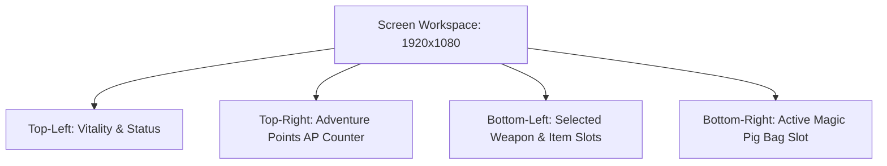
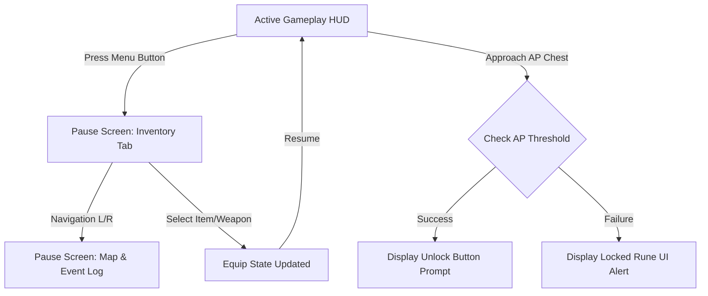

# User Interface (UI) & HUD Specification
## Project: The Legacy of Tomba & the Evil Pigs' Curse

---

## 1. HUD (Heads-Up Display) Layout Specification

During active gameplay, the HUD must provide critical physics and state feedback without cluttering the player's viewport. The screen coordinates are mapped using a normalized grid ($1920 \times 1080$ resolution).



### 1.1 Element Specifications

#### A. Vitality & Status Indicator (Top-Left)
* **Coordinate Anchors**: $X: 50, Y: 50$
* **Visual Representation**: A horizontal chain of stylized Yellow Vitality Bars. When damaged, a bar cracks and fades.
* **Mushroom Poisoning Indicator**: Under normal conditions, the portrait of the Savior is neutral. Under spore influence, the portrait changes:
  * *Weeping State*: Portrait shows the Savior crying. The entire HUD tint shifts to a desaturated blue.
  * *Laughing State*: Portrait shows a chaotic, wild laugh. The HUD tint shifts to a warm, vibrating orange.

#### B. Adventure Points (AP) Counter (Top-Right)
* **Coordinate Anchors**: $X: 1870, Y: 50$ (Right-aligned text)
* **Visual Representation**: Digital counter displaying lifetime accumulated AP.
* **Dynamic Feedback**: When AP is earned, the numerical difference rolls upward with a golden particle trail emitting from the target source to the counter.

---

## 2. Inventory & Key Items Screen

Pressing the Pause key halts game physics and brings up the Inventory Management screen. This screen is divided into three functional tabs: **Arsenal**, **Vesting**, and **Sacred Relics**.

### 2.1 The Magic Pig Bags Display
The bottom section of the pause menu displays the captured and unassigned Magic Pig Bags. These are crucial for tracking world purification progress.

### Visual Reference: Magic Pig Bags Inventory Layout
Here is how the UI displays the collection status of your elemental sealing tools:


*Figure 1: UI rendering of the elemental pouches. Greyed-out slots indicate bags still hidden in the unexplored regions.*

---

## 3. World Interactions & Gated Chests UI

When the Savior approaches an interactive object, a contextual button prompt appears dynamically above his head.

### 3.1 Gated AP Chest Interaction
When standing directly in front of an ancient AP Chest, the UI locks the camera focus slightly and displays the required threshold.

### Visual Reference: Sealed AP Chest Interface
Below is the visual mock-up for the AP gating feedback screen:


*Figure 2: In-game presentation of a sealed chest. The numerical runes pulse red if the player's current AP is below 100,000, turning golden-green once unlocked.*

```
* **Lock State Mechanics**:
  * **Locked**: Pressing the interact key triggers a low-frequency stone grinding sound. The runic number pulses brightly.
  * **Unlocked**: Triggered automatically when the Savior has $\ge$ the required AP. The stone seal cracks, the runes dissolve into golden light, and the chest lid opens to reveal the reward.
```

---

## 4. UI Transition Flow Chart

The transitions between gameplay, menus, and item acquisition are designed to be seamless.

