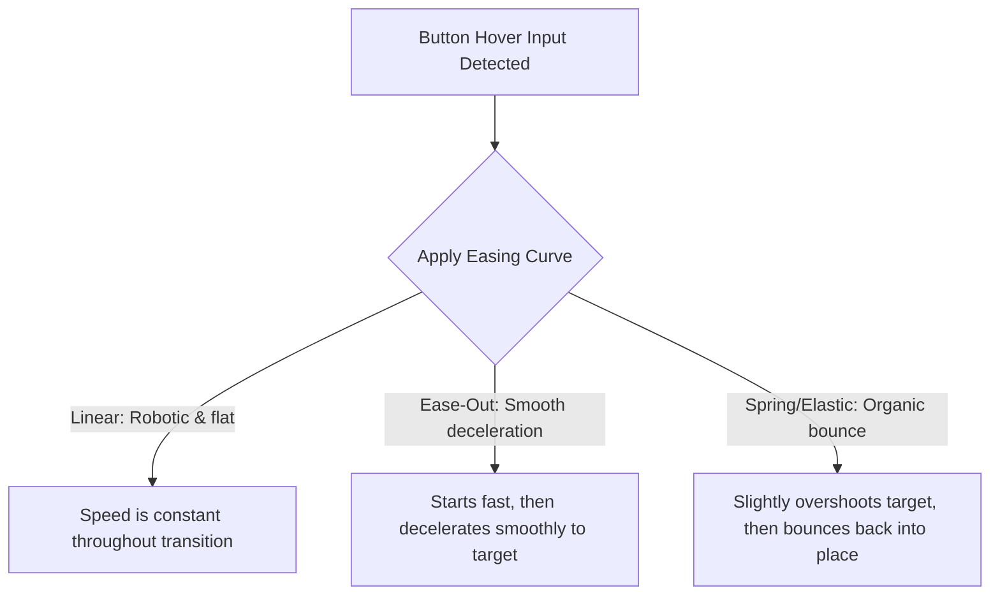
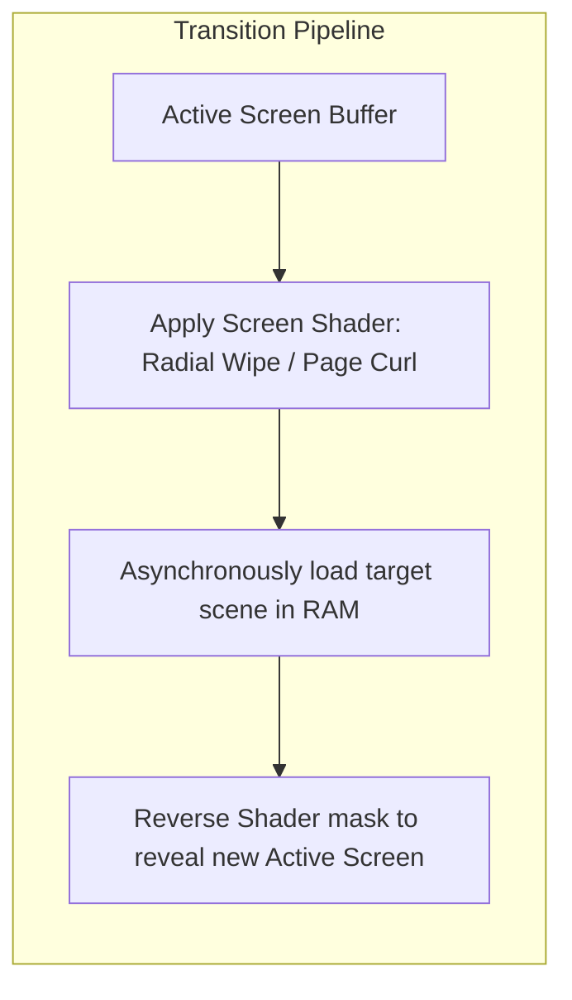

# UI Juice & Screen Transitions Specification
## Project: The Legacy of Tomba & the Evil Pigs' Curse

---

## 1. Introduction to UI Juice (The Dynamic Interface Concept)

In professional game design, the user interface (UI)—such as menus, buttons, and HUD health meters—must never feel static, flat, or dead. 
* **What is UI "Juice"?**: It refers to the polish, animations, and micro-reactions added to menus to make them feel highly reactive and organic.
* **Why it matters**: When a player hovers their cursor over a button, the button should not just instantly change color. It should bounce slightly, play a subtle click sound, and emit a soft glow. This instant feedback makes navigating menus feel extremely satisfying, increasing the perceived overall quality of the game.

---

## 2. Mathematical Easing Curves (The Feel of Movement)

UI elements do not move in straight, rigid lines (Linear movement), as this looks robotic and unnatural. Instead, they interpolate their positions and scales along mathematical **Easing Curves**.

### 2.1 The Spring-Bounce Equation
When a player highlights a button, its scale ($S$) expands from $1.0$ (standard size) to $1.15$ (highlighted size) using an elastic spring equation to create a bouncy recoil feel:

$$S(t) = 1.0 + 0.15 \times \left(1.0 - e^{-5t} \times \cos(10t)\right)$$

Where:
* $t$ represents elapsed transition time ($0.0$ to $0.2 \, \text{seconds}$).
* $e^{-5t}$ calculates the damping decay (how fast the bounce calms down).
* $\cos(10t)$ creates the back-and-forth wiggle wave.

---

## 3. Screen Transition Shaders (Scene Swaps)

Transitioning between game states (e.g., leaving a level and returning to the Title Screen) is smoothed using full-screen transition shaders.

### 3.1 Transition Archetypes
* **Radial Wipe**: A circular clock-like mask sweeps across the viewport, darkening pixels to black in a spiral path over $0.6 \, \text{seconds}$.
* **Gaussian Blur Fade**: Instead of fading to black, the active screen buffer's resolution is progressively downsampled while a Gaussian Blur filter increases its radius, creating a smooth dream-like defocus transition.

---

## 4. Button Hover & Selection Feedback Specs

All interactive button assets (such as options in the Title Screen or item slots in the Inventory) must adhere to strict visual feedback standards:

| Menu State Trigger | Target Scale Change | Alpha/Color Modification | Accompanying Audio Cue |
| :--- | :--- | :--- | :--- |
| **Normal / Idle** | $1.0 \times$ (Baseline) | Standard color channels, no outline. | None |
| **Hover / Highlighted**| $1.10 \times$ (Spring bounce) | Inner gold outline pulses slowly ($2 \, \text{Hz}$). | `SFX_UI_HOVER` (Quiet, mechanical click) |
| **Selected / Pressed** | $0.90 \times$ (Squash effect) | High exposure flash ($100\%$ white overlay for $0.05 \, \text{s}$). | `SFX_UI_CONFIRM` (Crisp, metallic ring) |