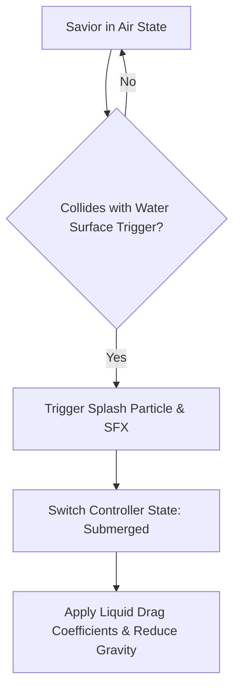
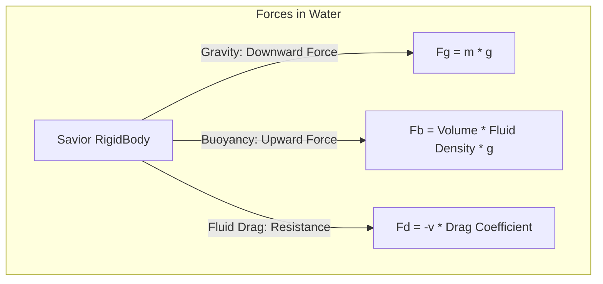

# Water Physics, Fluid Mechanics & Buoyancy Specification
## Project: The Legacy of Tomba & the Evil Pigs' Curse

---

## 1. Liquid State Transition Mechanics

When the Savior transitions from the Air or Ground state into a water body, his physics controller immediately swaps its gravity and friction matrices to simulate liquid density.

### 1.1 Transition Colliders
* **Water Surface Trigger**: Level designers place a thin, horizontal trigger line (`TR_WATER_SURFACE`) exactly on top of water bodies.
* **Splash Execution**: Passing through this trigger at a downward velocity $v_y \ge 5.0 \, \text{m/s}$ instantiates a dynamic water splash particle system and plays `SFX_PL_SPLASH`.

---

## 2. Buoyancy & Liquid Drag Physics

Inside water, gravity is counteracted by upward buoyancy forces, and standard lateral friction is replaced by fluid drag.

### 2.1 Mathematical Physics Values

| Physics Parameter | Value inside Water | Description |
| :--- | :--- | :--- |
| **Effective Gravity** | $2.5 \, \text{m/s}^2$ | Reduced from $32.0 \, \text{m/s}^2$ to allow slow-motion drifting. |
| **Water Drag (Linear)** | $3.0$ | Fluid resistance applied to horizontal and vertical movement vectors. |
| **Max Swim Speed** | $4.2 \, \text{m/s}$ | Standard swimming speed limit in any directional vector. |
| **Upward Floating Speed**| $1.5 \, \text{m/s}$ | Automatic vertical rise rate when no directional inputs are held. |

### 2.2 Buoyancy Equilibrium Formula
The net vertical force ($F_{\text{net\_y}}$) acting on the Savior while submerged is calculated as:

$$F_{\text{net\_y}} = F_b - F_g - (v_y \times \text{Linear Drag})$$

Where:
* $F_b$ is the upward buoyancy force.
* $F_g$ is the downward gravitational pull.
* $v_y$ is the Savior's active vertical velocity.

---

## 3. Dynamic Water Currents (Vector Fields)

Certain chambers inside the Water Temple contain active mechanical water pumps or broken pipe sluices that generate directional water currents.

### 3.1 Current Force Application
* **Area Effectors**: Current zones are bounded by rectangular trigger boxes containing a force vector variable ($\vec{F}_{\text{current}}$).
* **Movement Modification**: While the Savior overlaps with an active current area, the engine applies a continuous, non-resistible force to his RigidBody:

$$\vec{v}_{\text{final}} = \vec{v}_{\text{player}} + \vec{F}_{\text{current}}$$

* **Visual Trails**: To make currents visible to the player, bubbles and directional water particles flow constantly along the vector path.

---

## 4. Oxygen & Asphyxiation System

Submerging fully beneath the water surface activates the oxygen depletion timer.

* **Breath Limit**: $45 \, \text{seconds}$ (Default state).
* **Gear Modifiers**: Wearing the **Blue Deep Pants** extends this capacity to $90 \, \text{seconds}$.
* **HUD Feedback**: A circular blue bubble meter appears floating near the Savior’s head when oxygen levels drop below $50\%$.
* **Asphyxiation Damage Ticks**: When oxygen reaches $0\%$, the Savior enters a choking animation state, losing $1$ Vitality Bar every $5.0 \, \text{seconds}$ until he resurfaces, retrieves an air pocket bubble, or dies.