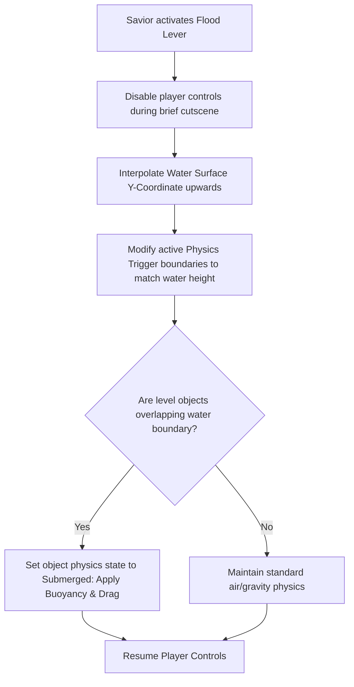
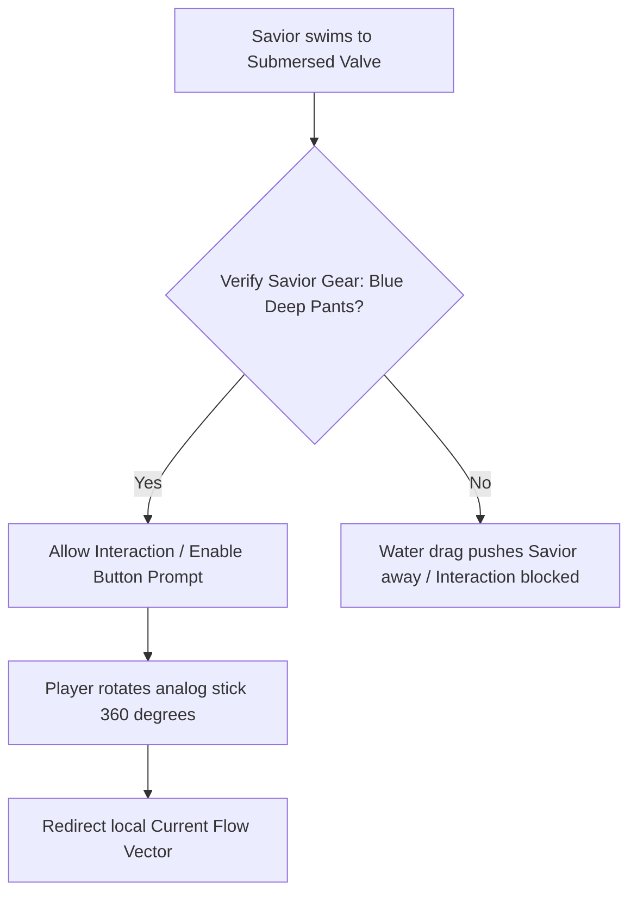
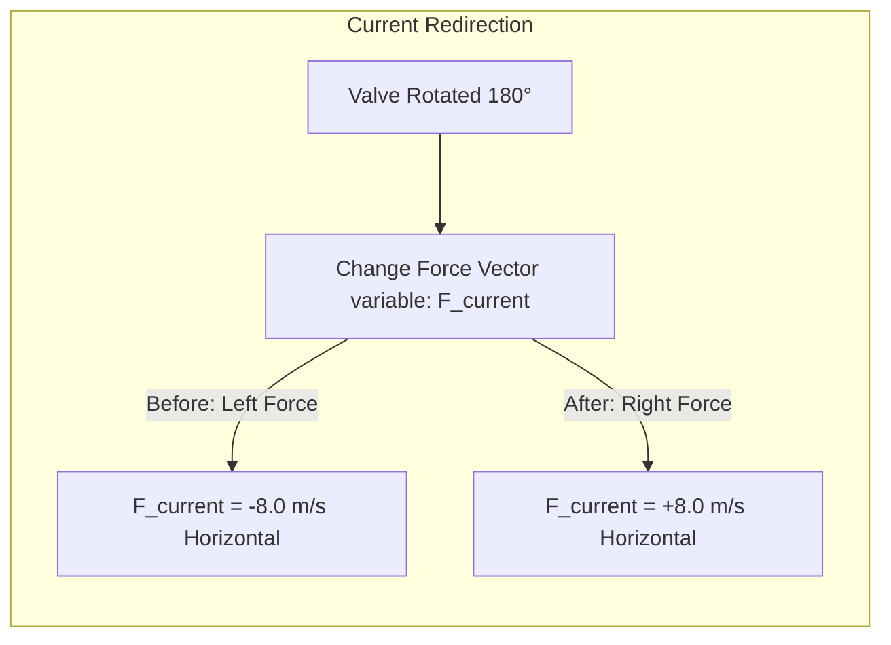

# Water Temple Level Mechanics & Valve System Specification
## Project: The Legacy of Tomba & the Evil Pigs' Curse

---

## 1. Introduction to Water Level Manipulation (The Puzzle Concept)

Inside the *Water Temple* (a key region of the second era), navigation is dictated by how water is directed through the ancient ruins.
* **The Concept**: Rather than water being a static visual element, players can actively alter the environment by flooding or draining rooms.
* **The Puzzle Mechanic**: If a room is drained, the Savior can walk normally and activate heavy floor buttons, but cannot reach high ledges. If the room is flooded, the Savior can swim upward to reach high exits, but deep currents might block his path or carry him into spiked walls.
* **Why it matters**: This dynamic water level shifting forces players to plan their paths, utilizing sub-aquatic levers and valves to redirect flow directions and access locked chambers.

---

## 2. Dynamic Water Level Raising (The Flood Mechanic)

Pulling a main Flood Gate Lever initiates a real-time modification of the active water volume height collider inside the level file.

### 2.1 Technical Water Rise Interpolation
When the flood sequence is active, the water surface mesh and its associated 2D Trigger box collider move vertically along the Y-axis over $4.0 \, \text{seconds}$:

$$\text{Water}_y = \text{Lerp}(\text{FloorLevel}_y, \text{HighTideLevel}_y, \text{ElapsedTime} / 4.0)$$

This progressive rise ensures that any active entities (like Koma Pigs or floating crates) caught in the rising boundary transition smoothly from standard gravity to liquid buoyancy physics without clipping or jarring speed spikes.

---

## 3. Sub-Aquatic Lever & Valve Interaction

Traditional wall levers cannot be used underwater due to hydrodynamic resistance. The Savior must interact with specialized **Heavily-Weighted Valves**.

* **Interaction Mechanic**: Attempting to turn an underwater valve without wearing the **Blue Deep Pants** fails. The natural water resistance and drag push the Savior back, preventing the action.
* **The Rotation Input**: To simulate turning a heavy metal wheel valve, the player must rotate the analog stick on their controller in a full $360^\circ$ circle. This increases player immersion by making the physical struggle of underwater labor tangible on the gamepad.

---

## 4. Redirecting Water Current Vectors

Vanes inside the piping segments generate continuous directional flow vectors. Turning a valve flips the direction of these current forces.

* **Visualizing the Change**: Upon turning the valve, the visual bubble particles (`PART_BUBBLE_STREAM`) instantly alter their flight vectors, sliding along the new force direction to show the player that the sub-aquatic path is now safe and accessible to swim through.